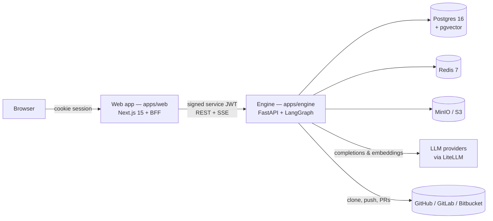

# ASEP — AI Software Engineering Platform

ASEP is a platform where a team of AI agents does real software engineering work:
you describe a feature, the agents plan it, write the code in an isolated copy of
your repository, review and test their own changes, and open a pull request for a
human to approve. Alongside that, it indexes your codebase so you can ask questions
and get answers that cite real files and lines.

It is a working system, not a demo. The full engineering loop — plan, approve,
implement, review, test in a sandbox, scan for secrets, open a PR — runs end to
end, and the whole thing can run offline with a fake model so you can try it
without an API key.

> **New here?** [`docs/HOW_IT_WORKS.md`](docs/HOW_IT_WORKS.md) is the gentlest
> introduction; the sections below are the reference. If you just want it
> running, jump to [Getting started](docs/getting-started.md).

## The problem it solves

Most "AI coding" tools stop at autocomplete or a chat box. The hard parts of
shipping software — turning a vague request into a plan, making changes that span
several files, reviewing a diff, running the tests, catching a leaked secret
before it reaches a PR — still land on a person. ASEP treats those steps as a
pipeline of specialized agents with a human approval gate in the middle, so the
routine engineering work is done for you and the judgment calls stay yours.

Two design commitments make it trustworthy rather than just impressive:

- **The agents never touch your real repository.** Every run works in a jailed,
  per-run clone; the only thing that reaches your repo is a pull request you
  approve.
- **Nothing is a black box.** Every step an agent takes is written to a live
  timeline you can watch, and the reasons behind each action are recorded too.

## What it does

- **Chat with your codebase.** Connect a repository, and answers cite the actual
  files and line ranges they came from, blended with the platform's long-term
  memory.
- **Ship a feature with an agent team.** A Product Manager agent writes a plan you
  approve; Backend, Frontend, and DevOps agents implement it; a Reviewer critiques
  the diff; the tests run in a locked-down Docker sandbox; the diff is scanned for
  secrets and vulnerable dependencies; and a pull request opens on GitHub, GitLab,
  or Bitbucket.
- **Understand a repository.** Tree-sitter parsing and vector + full-text search
  power grounded answers and a dependency/architecture graph.
- **Plan and remember.** A Scrum Master agent turns a one-line goal into an
  estimated, dependency-aware backlog; finished runs leave durable memory that
  feeds the next run's planning.
- **Work where you already are.** File browser, editor, git panel, and a sandboxed
  terminal on the run page; outbound Slack, Linear, and Jira integrations.
- **Run in production.** Kubernetes + Helm, row-level security, OpenTelemetry
  metrics and alerting, verified backups, and rate limiting.

The full history of what shipped and when lives in [`docs/ROADMAP.md`](docs/ROADMAP.md)
and [`docs/BACKLOG.md`](docs/BACKLOG.md).

## Architecture at a glance

Three processes and three data stores. The browser never talks to the engine
directly — the web app is a trust boundary that signs a short-lived token and
proxies every call.



- **`apps/web`** — the UI and a Backend-for-Frontend (BFF). It owns identity
  (better-auth), and every `/api/*` route checks your session, signs a service
  JWT, and forwards to the engine. Nothing else can reach the engine.
- **`apps/engine`** — the Python service that does the work: the agent runtime
  (LangGraph), model access (LiteLLM), repository indexing, and all persistence.
- **Data stores** — Postgres (with pgvector for embeddings) is the system of
  record; Redis is the event doorbell and job queue; MinIO/S3 holds run artifacts.

The reasoning behind this split — and every other significant decision — is in
[`docs/architecture.md`](docs/architecture.md) and the
[ADRs](docs/architecture/adr/).

## Technology stack

| Area | Choices |
|---|---|
| Web | Next.js 15 (App Router), TypeScript (strict), Tailwind v4, better-auth |
| Engine | Python 3.12, FastAPI, SQLAlchemy 2 (async, psycopg 3), Alembic, LangGraph, LiteLLM |
| AI | LiteLLM model router (planner / coder / cheap tiers), pgvector embeddings, tree-sitter parsing |
| Data | Postgres 16 + pgvector, Redis 7, MinIO (S3-compatible) |
| Tooling | pnpm + Turborepo, uv (Python), ruff + pyright, ESLint + Prettier, Vitest + pytest, Playwright |
| Ops | Docker Compose (dev), Kubernetes + Helm (prod), OpenTelemetry, arq workers |

## Getting started

Prerequisites: **Node 22+**, **pnpm 11+**, **Python 3.12+**,
[**uv**](https://docs.astral.sh/uv/), and **Docker Desktop** (WSL2 on Windows).

```sh
cp .env.example .env      # then set one LLM key, or leave LLM_FAKE=1 to run offline
pnpm install
cd apps/engine && uv sync && cd ../..
pnpm db:up                # Postgres, Redis, MinIO in Docker
pnpm db:migrate           # engine (Alembic) + auth (better-auth) schemas
pnpm dev                  # web on :3000, engine on :8000
```

Sign up at http://localhost:3000/sign-up, then open `/chat`. The full walkthrough,
including how to verify each piece is working, is in
[`docs/getting-started.md`](docs/getting-started.md).

## Configuration

A single `.env` at the repository root feeds three consumers: Docker Compose, the
engine (via pydantic-settings), and the web app (loaded in `next.config.ts`).
Never commit it — copy [`.env.example`](.env.example), which documents every
variable inline. The essentials:

| Variable | Purpose |
|---|---|
| `LLM_FAKE` | `1` returns canned model responses — run and test with no API key |
| `ANTHROPIC_API_KEY` / `OPENAI_API_KEY` / `GEMINI_API_KEY` | Provider keys; set at least one for real output |
| `MODEL_PLANNER` / `MODEL_CODER` / `MODEL_CHEAP` | The three model tiers (any LiteLLM id) |
| `DATABASE_URL` / `DATABASE_URL_API` | Postgres, and the non-owner role for user-scoped sessions |
| `ENGINE_SERVICE_SECRET` | Signs the web→engine service JWT |
| `GITHUB_TOKEN` | Lets runs push branches and open pull requests |

The reasoning behind the more consequential settings (privilege separation,
encryption keys, the sandbox and rate-limit knobs) is explained in
[`docs/getting-started.md`](docs/getting-started.md#configuration).

## Repository layout

```
apps/
  web/                Next.js UI + BFF (App Router routes, auth, service-token signing)
  engine/             FastAPI engine: agents, LLM router, indexing, DB, migrations
packages/
  shared/             TypeScript types generated from the engine's OpenAPI schema
infra/
  docker/             Compose stack for local dev (Postgres, Redis, MinIO)
  helm/               Production Kubernetes chart
docs/                 Guides (this layer), architecture notes, ADRs, roadmap, backlog
```

A file-by-file tour is in [`docs/architecture.md`](docs/architecture.md#where-things-live).

## Documentation

Start with the guide that matches what you need:

| Guide | Read it when you want to… |
|---|---|
| [How it works](docs/HOW_IT_WORKS.md) | Understand the product without reading code |
| [Getting started](docs/getting-started.md) | Install, configure, run, and verify locally |
| [Architecture](docs/architecture.md) | Understand how the system is shaped and why |
| [Development](docs/development.md) | Work in the codebase — conventions, testing, adding a feature |
| [API overview](docs/api.md) | Understand the engine's API surface and the trust model |
| [Deployment](docs/deployment.md) | Run it in production (Kubernetes, backups, observability) |
| [Troubleshooting](docs/troubleshooting.md) | Fix a common problem quickly |

For depth, [`docs/architecture/`](docs/architecture/) holds a design note per
feature and [`docs/architecture/adr/`](docs/architecture/adr/) records the
decisions with trade-offs. [`docs/README.md`](docs/README.md) is the index.

## API overview

The engine exposes a versioned REST API under `/v1/*`, all of it behind the
BFF-signed service JWT (`/healthz` is the only public route). The routers map
cleanly to product areas — `chat`, `conversations`, `runs`, `repositories`,
`knowledge`, `work_items`, `documents`, `integrations`, `provider_keys`,
`terminal`, and `webhooks`. The web app never calls these directly; it goes
through its own `/api/*` proxy. See [`docs/api.md`](docs/api.md) for the full
surface and the auth model.

## Development workflow

```sh
pnpm dev          # run web + engine together (Turborepo)
pnpm lint         # ESLint + ruff
pnpm typecheck    # tsc + pyright
pnpm test         # Vitest + pytest
pnpm e2e          # Playwright smoke (needs the DB up; uses LLM_FAKE)
```

Every change follows the same loop, enforced by the pull-request template:
design note → API spec → migration → UI → implementation → tests → docs →
performance/security pass. [`docs/development.md`](docs/development.md) walks
through it with a worked example.

## Testing

The engine suite (`pytest`) needs Postgres running (`pnpm db:up`); it creates and
drops its own `asep_test` database and runs the whole suite under row-level
security. `LLM_FAKE=1` makes agent runs deterministic and free, so most behavior
is reproducible offline in seconds. The web app uses Vitest, and Playwright drives
an end-to-end smoke against the compose stack. Details and patterns are in
[`docs/development.md`](docs/development.md#testing).

## Deployment

Production runs on Kubernetes via the Helm chart in `infra/helm`: one engine image
(API, worker, and migration job by command), the Next.js standalone build, health
probes, a pre-upgrade migration job, and the engine kept private behind the BFF.
The full picture — images, secrets, observability, backups, and the handful of
operator-gated steps — is in [`docs/deployment.md`](docs/deployment.md).

## Contributing

The [pull-request template](.github/PULL_REQUEST_TEMPLATE.md) is the Definition of
Done; each item is there for a reason. In short:

- Branch off `main`; keep commits focused and reviewable.
- Write (or update) the design note before the code — see
  [`docs/development.md`](docs/development.md).
- Keep the suites green: `pnpm lint`, `pnpm typecheck`, `pnpm test`.
- Update the docs and the backlog in the same change they describe.

## License

No license file is present yet. Until one is added, treat this repository as "all
rights reserved" and check with the maintainer before reuse.
