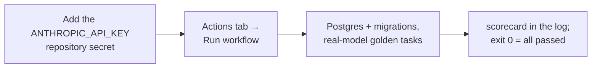

# Evaluating the Agent Team

How we measure whether the agents actually work — with a fixed target and
fixed tasks, so results are comparable from one day to the next.

## The pieces

- **`fixtures/demo-service/`** — a tiny FastAPI service with a static web
  page. It has a seeded bug on purpose (`GET /items/3` crashes instead of
  returning 404). Every evaluation copies this folder into a fresh git
  repository, so nothing real is ever touched.
- **Three golden tasks** (defined in `apps/engine/src/engine/evaluation.py`):
  1. add a `/stats` endpoint,
  2. find and fix the seeded bug,
  3. add a configurable item limit.
- **The scorecard script** — runs each task through the real pipeline
  (plan → auto-approve → engineers → review) and scores it.

## Run it

```sh
pnpm db:up                                   # Postgres must be running
cd apps/engine
uv run python scripts/eval_agent_team.py
```

Each task is scored on four checks:

| Check | Meaning |
|---|---|
| planned | the Product Manager produced a valid plan |
| completed | the run finished without failing |
| commits | the engineers actually committed changes |
| diff match | the changes contain what the task asked for |

With `LLM_FAKE=1` the diff check is skipped (offline agents write placeholder
files) — that mode just proves the pipeline machinery works, and it's also
covered by the test suite. With a real model key in `.env` all four checks
count, and the score tells you how good the team really is.

The eval runs appear in the `/runs` page like any other run, so you can watch
them and read their timelines afterwards.

## Run it in CI

The offline scorecard runs on every push already (it is part of the engine test
job). The **real-model** scorecard is a separate, manual workflow —
`.github/workflows/evaluation.yml` — because a real run spends tokens and should
never fire on its own.



To arm it: add an `ANTHROPIC_API_KEY` repository secret (and `GEMINI_API_KEY`
only if you want semantic code search available to the agents), then trigger
**Real-model evaluation** from the Actions tab. Without the secret the job fails
immediately with a one-line message saying what to add — it never silently
passes. The three tiers all run on the one Anthropic key; the run stops any
single task that exceeds a small cost cap, so a runaway cannot rack up spend.
