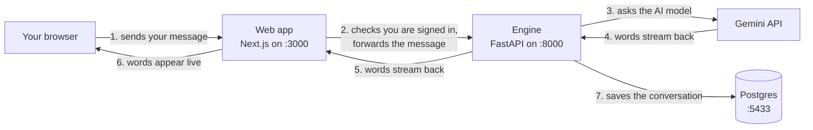
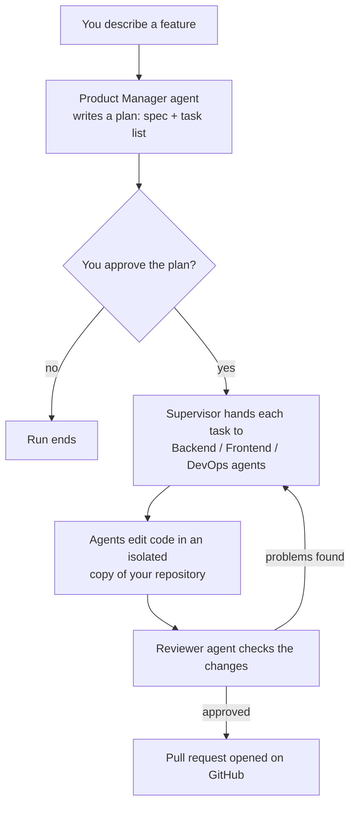

# How ASEP Works

Read this first. Plain language, real file names, no jargon.

## What the app does today

You sign in, type a message, and get a streamed AI reply that is saved to the
database. That's it — everything else is being built on top of this spine.

## The three processes



- **Web app** (`apps/web`) — the pages you see, sign-in, and a thin relay to the engine.
- **Engine** (`apps/engine`) — Python service that talks to the AI models and the database.
- **Postgres** — stores users, conversations, messages, and agent runs.

## One chat message, step by step

1. You press Enter. `apps/web/src/components/chat/chat-panel.tsx` sends your
   text to `/api/chat`.
2. `apps/web/src/app/api/chat/route.ts` checks your login session, then
   forwards the request to the engine with a signed pass
   (a short-lived token proving "the web app sent this").
3. The engine (`apps/engine/src/engine/api/chat.py`) loads your conversation
   history from Postgres.
4. `engine/llm/router.py` picks the model (set by `MODEL_CODER` in `.env`,
   currently Gemini 2.5 Flash) and calls it.
5. Each word streams back through the same path and appears on your screen.
6. When the reply finishes, the engine saves both messages to Postgres.

Set `LLM_FAKE=1` in `.env` and the engine skips step 4 and returns a canned
reply — that's how tests run without an API key.

## What we're building now (Phase 1)

A team of AI agents that ships a feature for you:



The whole flow above exists now. Open `/runs`, describe a feature, and the
Product Manager reads a clone of your repository and writes a plan; after you
press Approve, the engineer agents edit files and make git commits inside
that clone — never in your real repository. The Reviewer then checks the full
diff: it can send findings back to the engineers once, and its second verdict
is final. On approval the branch is pushed and — when the repository is on
GitHub and `GITHUB_TOKEN` is set in `.env` — a pull request opens, linked
from the run page. Every step lands in the timeline. With `LLM_FAKE=1` the
same pipeline runs without an AI model (a fixed plan, real files, real
commits) — that's how the tests work. Progress lives in
[BACKLOG.md](BACKLOG.md).

## Run it

```sh
pnpm db:up        # start Postgres, Redis, MinIO in Docker
pnpm db:migrate   # create/update database tables
pnpm dev          # web on http://localhost:3000, engine on :8000
```

Sign up at `http://localhost:3000`, open the chat, send a message.
