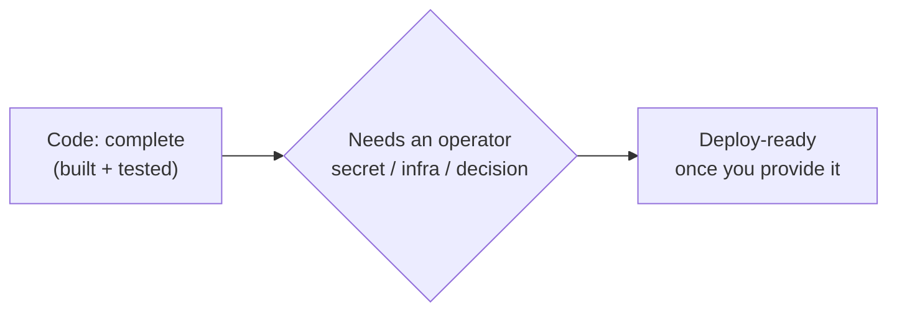

# Operator Handoff — what's left, and what each item needs from you

All the self-contained engineering work is done: Phases 0–7's codeable items
ship and are tested. What remains is *operator-gated* — each item needs a
secret, a running piece of infrastructure, or a decision that only you can
make. None of it can be built and honestly verified from the code alone, so it
waits here until you're ready to wire it up.

## The remaining items

| Item | What it does | What it needs from you |
|---|---|---|
| **Real-model eval in CI** | Runs the agent team against the golden tasks with a *real* model and scores the diff (the offline mechanics score already runs) | A provider-key secret in CI (Anthropic or OpenAI) and the go-ahead to spend tokens on each run |
| **Alerting rules** | Pages someone when error rate, p95 latency, or token spend crosses a line | A monitoring backend to send to, and real traffic to calibrate the thresholds so they don't cry wolf |
| **BFF → engine mutual TLS** | Stops anything but the web app's BFF from calling the engine, even inside the cluster (today the engine trusts a signed JWT — ADR-0002 debt) | A certificate authority (or a Kubernetes network policy) and the call on which approach fits your cluster |
| **Ship backups off-host** | Copies the nightly Postgres dump somewhere that survives the machine burning down (today it lands in a local directory) | Object-store credentials (S3 or MinIO) *or* a Kubernetes volume the backup Job can mount |
| **Backup volume template** | The Kubernetes piece that pairs with the above when the worker writes backups | The same volume decision as off-host backups |
| **In-cluster QA sandbox** | Lets the QA step run tests in a real sandbox inside Kubernetes (pods have no Docker daemon, so it's off by default there) | An infrastructure choice: Docker-in-Docker, Kata containers, or a remote builder |
| **Helm resource limits** | Sizes each pod's CPU/memory requests and limits so the cluster schedules them well | Benchmark numbers on the hot paths under your expected load, to size against real figures instead of guesses |

## How to pick one up

Tell me which item, and hand over the one thing it's waiting on — the secret,
the endpoint, or the decision. From there the work is ordinary: a design note
first, then the change, tests where they can run, and the deploy wiring. Until
then the platform runs end to end in development exactly as built.
