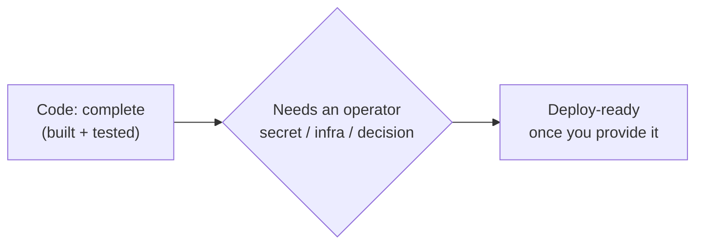

# Operator Handoff — what's left, and what each item needs from you

All the self-contained engineering work is done: Phases 0–7's codeable items
ship and are tested. What remains is *operator-gated* — each item needs a
secret, a running piece of infrastructure, or a decision that only you can
make. None of it can be built and honestly verified from the code alone, so it
waits here until you're ready to wire it up.

Where a piece could be built and exercised against the dev stack, it has been:
off-host backups, for instance, are implemented and tested against the compose
MinIO — all that's left there is pointing them at a production bucket.

## The remaining items

| Item | What it does | What it needs from you |
|---|---|---|
| **Real-model eval in CI — arm it** | The workflow is *built* (manual **Real-model evaluation** in the Actions tab) and runs the golden tasks against a real model | Only the `ANTHROPIC_API_KEY` repository secret; then trigger it when you want to spend a few US$ on a run |
| **Alerting rules — load and tune them** | The rules are *built* (`infra/monitoring/alerting-rules.yml`: error rate, p95 latency, LLM spend) and the cost metric they need is emitted | A Prometheus-compatible backend to load them into, an alert manager to route to, and real traffic to calibrate the starting thresholds |
| **BFF → engine mutual TLS** | Stops anything but the web app's BFF from calling the engine, even inside the cluster (today the engine trusts a signed JWT — ADR-0002 debt) | A certificate authority (or a Kubernetes network policy) and the call on which approach fits your cluster |
| **Off-host backups — turn it on** | The upload itself is *built* (`BACKUP_S3_BUCKET` ships each dump to S3/MinIO/R2) | Only a production bucket and its credentials (or an IAM role on the pod) — no code left to write |
| **In-cluster QA sandbox** | Lets the QA step run tests in a real sandbox inside Kubernetes (pods have no Docker daemon, so it's off by default there) | An infrastructure choice: Docker-in-Docker, Kata containers, or a remote builder |
| **Helm resource limits** | Sizes each pod's CPU/memory requests and limits so the cluster schedules them well | Benchmark numbers on the hot paths under your expected load, to size against real figures instead of guesses |

## How to pick one up

Tell me which item, and hand over the one thing it's waiting on — the secret,
the endpoint, or the decision. From there the work is ordinary: a design note
first, then the change, tests where they can run, and the deploy wiring. Until
then the platform runs end to end in development exactly as built.
