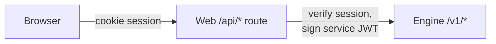

# API overview

The engine exposes a versioned REST API under `/v1/*`. This guide explains the
trust model and maps the routers to what they do; it is an orientation, not an
exhaustive endpoint reference. The authoritative, always-current contract is the
engine's own OpenAPI schema (served at `/openapi.json` when the engine is
running), from which `packages/shared` is generated.

## The trust model

Every `/v1/*` route requires a **service JWT** — an HS256 token signed by the web
app's BFF with `ENGINE_SERVICE_SECRET`, naming the acting user (`sub`) and, when
one is active, the organization (`org`). The only unauthenticated route is
`/healthz`.

The browser never holds or sends this token. The flow is always:

The web app's `/api/*` routes are thin proxies. Almost all of them go through one
helper, `proxyToEngine` in `apps/web/src/lib/bff.ts`, which checks the session,
signs the token, forwards the call, and relays the response. If you're adding an
endpoint, you add a router method on the engine and a one-line proxy route on the
web side — not authentication logic in both places. See
[`architecture/identity-integrations/BFF_PROXY.md`](architecture/identity-integrations/BFF_PROXY.md).

Two routes authenticate differently by design:

- **`/healthz`** is public, so orchestrators can probe it.
- **`/v1/webhooks/github`** is authenticated by an HMAC signature
  (`X-Hub-Signature-256`) rather than the service JWT, because GitHub is the
  caller, not the BFF. See [`architecture/execution-qa/WEBHOOK_REVIEWER.md`](architecture/execution-qa/WEBHOOK_REVIEWER.md).

## The routers

Each router in `apps/engine/src/engine/api/` maps to a product area. In rough order
of how central they are:

| Router | Responsibility | Design note |
|---|---|---|
| `chat` | Grounded chat: retrieval + memory + streamed model reply | [GROUNDED_CHAT](architecture/repository-intelligence/GROUNDED_CHAT.md) |
| `conversations` | List, rename, delete, search, and export conversations | [CONVERSATION_MANAGEMENT](architecture/chat/CONVERSATION_MANAGEMENT.md) |
| `runs` | Start, watch (SSE), approve, search, rerun, delete agent runs; reports and stats | [AGENT_RUNTIME](architecture/agents/AGENT_RUNTIME.md) |
| `repositories` | Connect, index, search, and graph a repository | [REPOSITORY_INTELLIGENCE](architecture/repository-intelligence/REPOSITORY_INTELLIGENCE.md) |
| `work_items` | The planning backlog: create, reorder, estimate, insights | [PLANNING_SUITE](architecture/planning-knowledge/PLANNING_SUITE.md) |
| `knowledge` | Long-term memory: list, add, delete, search | [KNOWLEDGE_AND_MEMORY](architecture/planning-knowledge/KNOWLEDGE_AND_MEMORY.md) |
| `documents` | Generated docs (README, API reference, changelog, architecture) | [DOCUMENTATION_SUITE](architecture/planning-knowledge/DOCUMENTATION_SUITE.md) |
| `integrations` | Connect and test Slack, Linear, Jira, and source hosts | [EXTERNAL_INTEGRATIONS](architecture/identity-integrations/EXTERNAL_INTEGRATIONS.md) |
| `provider_keys` | Store and share bring-your-own model keys (encrypted) | [PROVIDER_KEYS](architecture/identity-integrations/PROVIDER_KEYS.md) |
| `terminal` | The sandboxed in-browser command console on a finished run | [IN_BROWSER_TERMINAL](architecture/runs-ui/IN_BROWSER_TERMINAL.md) |
| `webhooks` | Inbound GitHub pull-request events for the review agent | [WEBHOOK_REVIEWER](architecture/execution-qa/WEBHOOK_REVIEWER.md) |
| `health` | The public `/healthz` liveness probe | — |

## Streaming endpoints

Two kinds of response stream over Server-Sent Events rather than returning a single
body:

- **Chat** streams model tokens (`event: token`, then `event: done`). The BFF pipes
  the stream through untouched.
- **Run timelines** stream agent events as they happen, with a resume cursor
  (`Last-Event-ID`) so a reconnecting client picks up where it left off. See
  [`architecture/agents/RUN_EVENT_STREAMING.md`](architecture/agents/RUN_EVENT_STREAMING.md).

## Versioning and changes

The API is versioned by the `/v1` prefix. When you change a response shape,
regenerate the shared client types with `pnpm generate` and commit them with the
change, so the web app and the engine never drift. Adding a field is safe; removing
or renaming one is a breaking change and should be treated as such.
