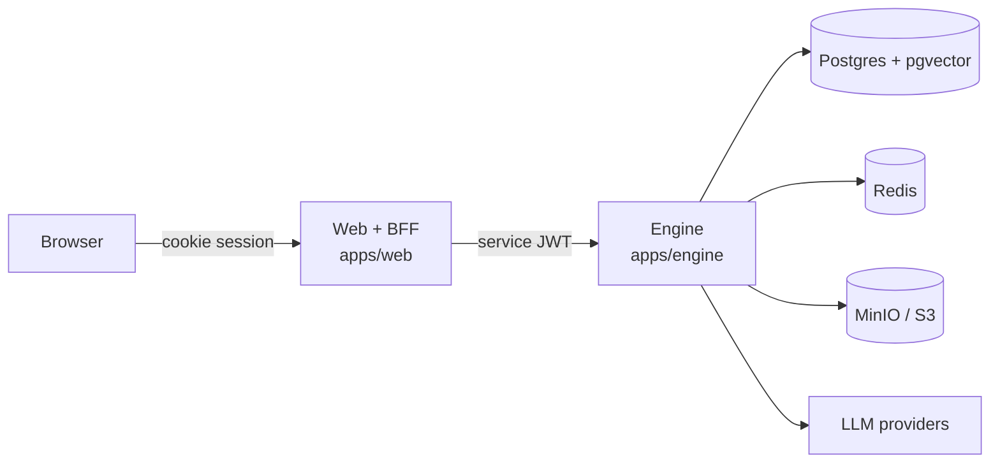
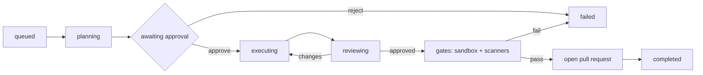

# Architecture

This is the reader's guide to how ASEP is shaped and why. It explains the moving
parts and the decisions behind them; for the C4-style diagrams and data-ownership
tables see [`architecture/OVERVIEW.md`](architecture/OVERVIEW.md), and for each
decision's trade-offs see the [ADRs](architecture/adr/). Every feature also has
its own design note under [`architecture/`](architecture/).

## The shape of the system

ASEP is three processes and three data stores.



The single most important line in the whole design is that **the browser never
talks to the engine.** The web app is a Backend-for-Frontend (BFF): it owns the
user's session, and every `/api/*` route verifies that session, signs a
short-lived HS256 service JWT naming the acting user, and proxies the call to the
engine's `/v1/*` API. The engine trusts that token and nothing else. In
development the engine isn't exposed publicly at all; in production it sits on a
private network behind the BFF. This is [ADR-0002](architecture/adr/0002-service-split-web-bff-python-engine.md),
and it's why "who is allowed to do this?" is answered in exactly one place.

Why split web and engine at all? The UI work is a natural fit for the TypeScript
and Next.js ecosystem, and the AI work — LangGraph, LiteLLM, the Python data and
ML libraries — is a natural fit for Python. Rather than compromise on either, each
runs in its own process and they meet at a small, signed HTTP contract.

## Two request shapes

Almost everything the product does is one of two flows. Learn both and the rest
is variation.

### A chat message

The walking skeleton, and the simplest full lifecycle:

1. The browser posts your message to the BFF (`apps/web/src/app/api/chat/route.ts`).
2. The BFF checks your session, signs a service JWT, and forwards to the engine
   (`apps/engine/src/engine/api/chat.py`).
3. The engine loads conversation history, retrieves relevant code chunks and
   memories, and calls the model through the `ModelRouter`.
4. Tokens stream back over Server-Sent Events, through the BFF untouched, to the
   browser. When the reply finishes, both messages are saved to Postgres.

Streaming is one-directional (server → client), so SSE is a better fit than
WebSockets — [ADR-0004](architecture/adr/0004-redis-arq-jobs-and-sse.md).

### An agent run

The heart of the product. A feature request becomes a pull request through a
pipeline of agents with a human gate in the middle:



One file owns this lifecycle — `apps/engine/src/engine/agents/runner.py` — and
reading it top to bottom is the fastest way to understand the product. The
supporting pieces:

- **The Product Manager agent** turns the request into a spec and a task board,
  then the run pauses at `awaiting_approval` (a LangGraph interrupt) for a human.
- **The Supervisor** routes each approved task to the Backend, Frontend, or DevOps
  agent, which edit files through jailed tools in a per-run clone.
- **The Reviewer** critiques the diff and can send it back once; its second
  verdict is final.
- **The gates** run the workspace's tests in a network-isolated Docker sandbox and
  scan the diff for leaked secrets and vulnerable dependencies. Any gate failing
  fails the run — no pull request opens.

The design note is [`architecture/agents/AGENT_RUNTIME.md`](architecture/agents/AGENT_RUNTIME.md);
the agent runtime choice is [ADR-0005](architecture/adr/0005-langgraph-agent-runtime.md).

## The parts, and why they're built the way they are

### Identity lives in the web app

better-auth owns identity — the `user`, `session`, `organization`, and related
tables. The engine never writes them; its own tables reference user ids as plain
text columns with no foreign keys, which keeps two schema owners cleanly
decoupled ([ADR-0007](architecture/adr/0007-better-auth-identity-rbac.md)). If you
go looking for a `users` table in the engine's models and don't find one, this is
why.

### Model access goes through one router

Every call to a language model goes through `engine/llm/router.py` (`ModelRouter`)
— never `litellm` directly. The router picks the tier (planner / coder / cheap),
enforces the per-run budget, records cost and token metrics, and resolves the
right key (a user's bring-your-own key, then the environment). Routing all model
traffic through one seam is what makes cost control, tiering, and offline mode
(`LLM_FAKE`) possible at all ([ADR-0006](architecture/adr/0006-litellm-model-router-and-cost.md)).

### Agents are jailed, on purpose

An agent can only touch files through a small set of tools, and every path those
tools resolve is forced inside the run's workspace by `engine/workspace/jail.py` —
the security-critical file of the repository. There is no arbitrary shell; the
only code execution happens later, in the sandbox, with the network unplugged.
The tool security model is [ADR-0008](architecture/adr/0008-agent-tool-security-model.md).

### Postgres is the record; Redis is the doorbell

A run's timeline is a stream of rows in `agent_events`. When a step writes an
event, it also pings Redis; the SSE endpoint wakes on the ping and reads the new
rows from Postgres. If Redis is down, a periodic heartbeat covers it and nothing
is lost — Redis is a latency optimization, never a source of truth. The same
principle drives run recovery: the task board *is* the checkpoint, so a run
interrupted by a restart resumes from Postgres. See
[`architecture/agents/RUN_EVENT_STREAMING.md`](architecture/agents/RUN_EVENT_STREAMING.md) and
[`architecture/agents/RUN_RECOVERY.md`](architecture/agents/RUN_RECOVERY.md).

### Postgres does the access control itself

Row-level security is enabled and forced on every ownership-carrying table. A user
session is pinned to its verified JWT subject, and Postgres refuses to return
another user's rows even if a query forgets its `WHERE` clause. The engine even
runs as a non-superuser role so it cannot bypass its own policies. This is
defense in depth behind the application checks, not a replacement for them — see
[`architecture/security/ROW_LEVEL_SECURITY.md`](architecture/security/ROW_LEVEL_SECURITY.md).

### One data store, until it hurts

Postgres with the pgvector extension holds relational data *and* the code
embeddings, so retrieval is a single database rather than a separate vector store
to operate and keep consistent ([ADR-0003](architecture/adr/0003-postgres-pgvector-single-store.md)).
Redis handles the job queue and event bus; MinIO (S3-compatible) holds run
artifacts ([ADR-0009](architecture/adr/0009-object-storage-minio-s3.md)).

## Where things live

```
apps/web/src/app/          Next.js routes (App Router) + /api BFF proxy routes
apps/web/src/lib/          auth config, service-token signing, the proxyToEngine helper
apps/web/src/components/   UI components, grouped by product area
apps/engine/src/engine/
  api/                     FastAPI routers — one per product area
  agents/                  the agent runtime: runner, supervisor, role agents, tools, prompts
  llm/                     ModelRouter over LiteLLM
  indexing/                chunking, embeddings, hybrid retrieval, dependency graph
  workspace/               per-run clones and the path jail
  sandbox/                 the network-isolated Docker test runner
  security/                secrets and dependency scanners, encryption
  knowledge/               long-term memory: store, recall, capture
  planning/                backlog insights (blocker detection, priority)
  db/                      SQLAlchemy models, session, row-level-security policies
  migrations/              Alembic revisions
packages/shared/           TypeScript types generated from the engine's OpenAPI schema
infra/docker/              Compose stack for local dev
infra/helm/                Production Kubernetes chart
```

## Where to go next

- [Development](development.md) — conventions and how to add a feature.
- [API overview](api.md) — the engine's surface and the trust model in detail.
- [`architecture/OVERVIEW.md`](architecture/OVERVIEW.md) — diagrams and data-ownership tables.
- The [ADRs](architecture/adr/) — the decisions above, with the alternatives that were rejected.
