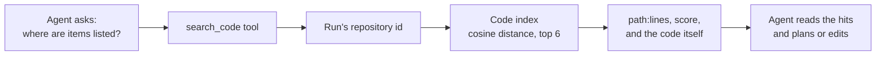

# Agents search the code index

## The problem

The agents explore a repository with `list_dir`, `read_file`, and a plain-text
`search`. That works when you already know the words in the file; it fails on
"where is authentication handled?" questions. Phase 2 built a semantic code
index — this change hands it to the agents as a tool.

## The tool

`search_code` joins the jailed toolbox. The agent describes what it is looking
for in plain words; the index answers with the closest chunks by meaning.

- The tool finds the run's repository through the workspace's run id, so no
  agent can point it at someone else's index.
- It reuses the exact retrieval behind grounded chat and repository search
  (`engine/indexing/retrieval.py`) — one ranking, three consumers.
- Read-only by nature, so it joins the shared read-tool set: the Product
  Manager grounds plans in it, engineers find related code, and the Reviewer
  can check claims.
- When the repository has no index yet (nobody pressed Index on the
  repositories page), the tool answers with guidance to use the plain `search`
  tool instead — never an error, so the agent just carries on.

## Deliberate limits

- Top 6 hits, ~500 characters of code each: enough to orient, small enough to
  keep the agent's context lean; `read_file` fetches the full file after.
- The index is a snapshot from the last indexing run, not the agent's live
  workspace edits — fine for orientation, wrong for verifying fresh changes
  (that is what `search` and `git_diff` are for; the prompts say so).
