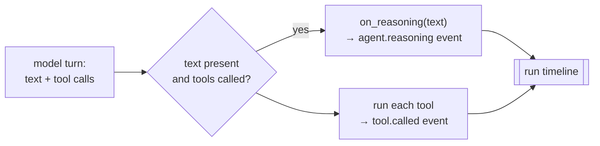

# Agent Reasoning on the Timeline — showing the "why", not just the "what"

**Status:** Design accepted · **Phase:** 8 follow-up · **Written:** 2026-07-22

## The problem

Phase 8 ([DELIBERATE_REASONING.md](DELIBERATE_REASONING.md)) made every role
*think → simulate → act*: the prompts now ask the model to reason before it
touches the workspace. But that reasoning is invisible. When an agent reads a
file and then edits it, the timeline shows `tool.called: read_file` and
`tool.called: apply_patch` — the *what* — but never the *why* the model wrote
just before those calls. The rationale is real; it just sits in the model's turn
and is dropped on the floor.

That note named the fix: *"a dedicated `agent.reasoning` event … would be the
next step if the rationale needs to be surfaced on the run page."* This is that
step.

## The design

In the shared loop (`agents/loop.py::run_tool_loop`), a model turn that calls
tools also carries text — the reasoning the model wrote *alongside* its decision
to act. Today that text is appended to the message history and forgotten. Now,
when a tool-calling turn has non-empty text, the loop hands it to an
`on_reasoning` observer, exactly as it already hands each tool call to
`on_tool`.

- **A parallel observer, purely additive.** `run_tool_loop` gains an optional
  `on_reasoning` callback next to `on_tool`; the runner builds one with
  `_reasoning_observer(run_id, agent, task_id)` beside the existing
  `_tool_observer`, and emits an `agent.reasoning` event (agent + task + the
  reasoning text). Every existing `on_tool` path is untouched.
- **Only tool-calling turns.** The *final* turn (no tool calls) is the agent's
  summary/answer, already recorded elsewhere — surfacing it again as "reasoning"
  would double it. Only the reasoning that precedes an action becomes an event.
- **The web renders it as its own line.** `event-text.ts` gets an
  `agent.reasoning` case, shown as the agent thinking, distinct from a tool call.

## Honest boundaries

- **Real-model only.** Under `LLM_FAKE=1` the canned reply carries no tool calls,
  so offline/demo runs emit no reasoning events — the same boundary as Phase 8's
  reasoning itself. The loop's emission is unit-tested directly with a stubbed
  model that returns a reasoning-plus-tool turn, so the behavior is proven
  without a real model even though the fake pipeline never triggers it.
- **No new storage or schema.** `agent.reasoning` is an ordinary `agent_events`
  row (type + JSONB payload), so it flows through the existing SSE stream,
  cursor pagination, and recovery with zero migration.
- **Not a full chain-of-thought capture.** This surfaces the reasoning the model
  volunteers in its action turns; it does not force a separate reasoning turn or
  a structured trace. A typed, validated reasoning artifact remains the richer
  future option Phase 8 already flagged.
