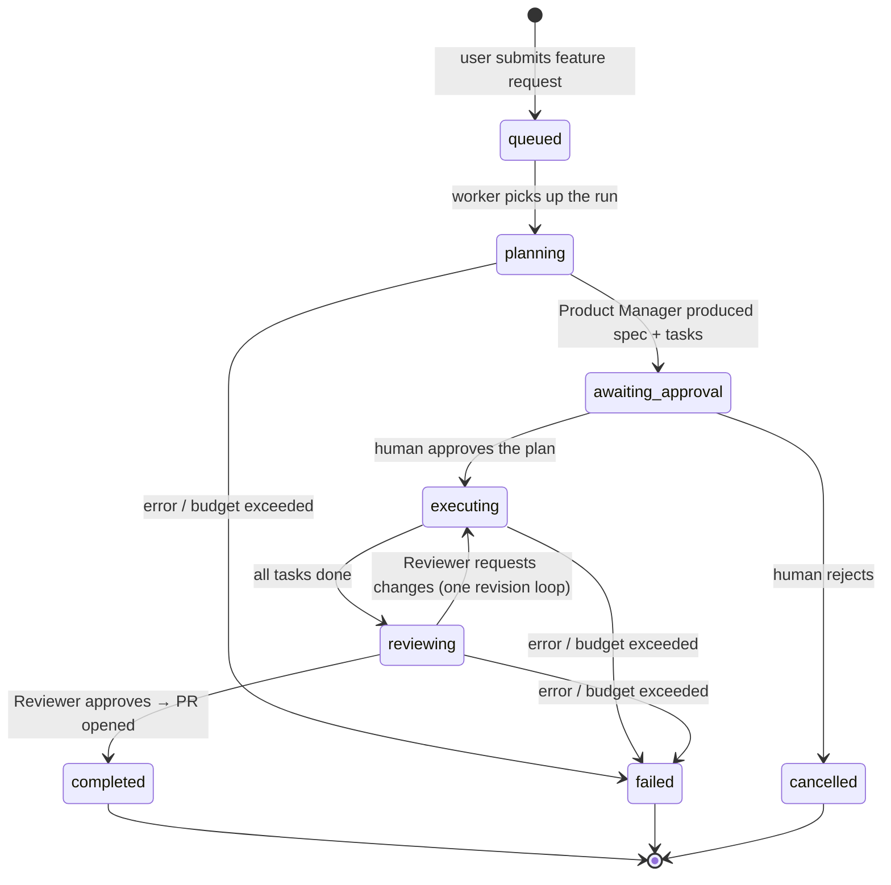
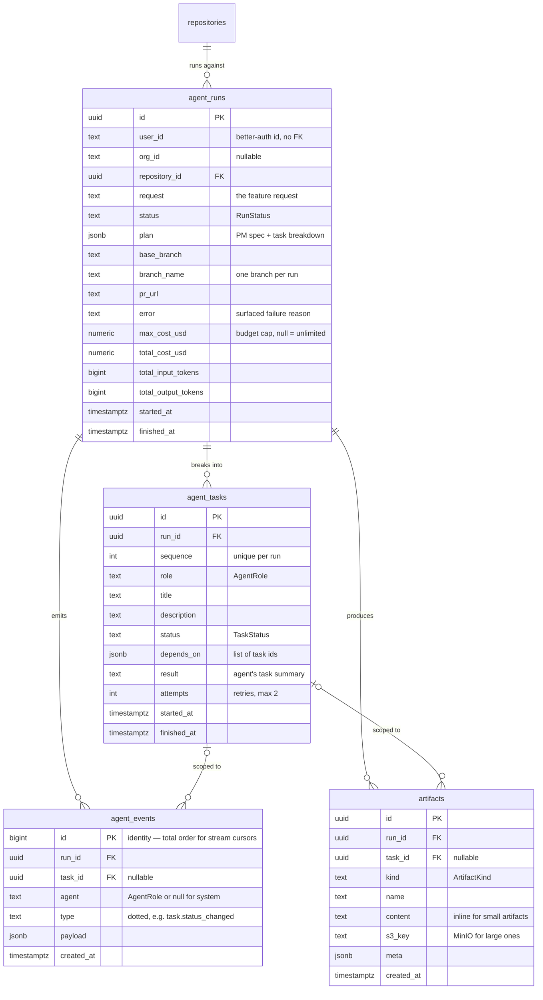

# Agent Runtime — Design Note

**Status:** Living document · **Phase:** 1 — Multi-Agent Engineering Team · **Last updated:** 2026-07-03
Companion decisions: [ADR-0005 LangGraph](adr/0005-langgraph-agent-runtime.md),
[ADR-0006 LiteLLM & cost controls](adr/0006-litellm-model-tiering.md),
[ADR-0008 agent tool security](adr/0008-agent-tool-security.md).

## What this is

The runtime that executes an agent-team run: a user's feature request flows through
a Product Manager agent (spec + task breakdown), a human approval gate, specialist
engineer agents (Backend / Frontend / DevOps) working in a per-run git worktree, and
a Reviewer critique loop — ending in a GitHub pull request. Everything observable
about a run is persisted so the mission-control UI can replay it live or after the fact.

## Run lifecycle

Task lifecycle: `pending → in_progress → done | failed | skipped`, with `blocked`
for tasks whose dependencies have not finished. The Supervisor retries a failed
task at most twice before failing the run.

## Domain model

Four tables carry the runtime state (Alembic revision `0002_agent_runtime`).
Identity stays with better-auth: `user_id` / `org_id` are plain text ids, no FKs
(ADR-0007). Status vocabularies live in `engine/db/enums.py` as `StrEnum`s and are
stored as plain strings — adding a status never needs a migration.

Design choices worth recording:

- **`agent_events.id` is a bigint identity, not a UUID.** The event stream endpoint
  (`/v1/runs/{id}/events`) needs a total order and a resume cursor (`Last-Event-ID`);
  a monotonically increasing integer gives both for free. A composite index
  `(run_id, id)` serves the "events for run X after cursor Y" query.
- **`plan` and `depends_on` are JSONB, not join tables.** The plan is a document the
  PM agent produces and the human approves as a unit; task dependencies are small
  lists read whole by the Supervisor. Neither is queried relationally yet — promote
  to tables only if that changes.
- **Budget columns live on the run.** `max_cost_usd` (cap) and the running totals are
  updated by the ModelRouter accounting hook (ADR-0006); the budget guard aborts the
  run and writes the reason into `error` with status `failed`.
- **Cascade deletes.** Deleting a run removes its tasks, events, and artifacts;
  deleting a repository removes its runs (development-phase policy — revisit for
  retention/audit before any hosted deployment; noted in the backlog debt register).

## How the pieces will consume this model

| Component (backlog item) | Reads / writes |
|---|---|
| Supervisor graph | routes on `agent_tasks.depends_on` + `status`; writes task transitions |
| Run event bus | inserts `agent_events`, publishes to Redis; SSE replays from Postgres by cursor |
| Budget guard | updates run totals per LLM call; flips run to `failed` when the cap is hit |
| Background worker (arq) | claims `queued` runs; LangGraph checkpoints make crash-resume safe |
| Mission-control UI | timeline = `agent_events`; task board = `agent_tasks`; cost widget = run totals |
| Reviewer loop | writes `artifacts` (`diff`, review verdict in `agent_events`), `pr_url` on the run |
