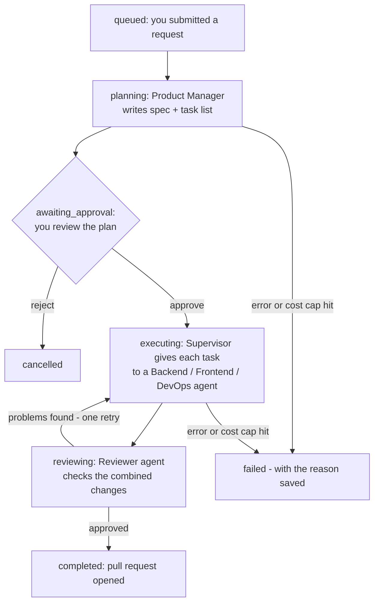

# Agent Runtime

One sentence: you describe a feature, AI agents plan it, you approve, they
write the code in an isolated copy of your repo, and you get a GitHub pull
request. This doc explains how a "run" moves through that pipeline and what
gets stored.

New here? Read [HOW_IT_WORKS.md](../HOW_IT_WORKS.md) first.

## A run's life

The words in bold-ish (`queued`, `planning`, …) are the exact `status` values
stored on the run, defined in `engine/db/enums.py`.

## Task rules (the Supervisor)

`engine/agents/supervisor.py` decides who works when. Three rules:

1. A task can start only after every task it depends on is done.
2. A failed task is retried, at most twice. Third failure fails the whole run.
3. If the run fails, tasks that never started are marked `skipped`.

## What gets stored (4 tables)

| Table | One row means | Read it as |
|---|---|---|
| `agent_runs` | one feature request | "the folder for everything below" |
| `agent_tasks` | one item on the plan's checklist | the task board in the UI |
| `agent_events` | one thing that happened | the live timeline in the UI |
| `artifacts` | one thing produced (spec, diff, PR link) | the run's outputs |

Details worth knowing:

- A run also stores the money spent (`total_cost_usd`) and its cap
  (`max_cost_usd`). Hitting the cap stops the run and the reason is saved
  in its `error` column.
- Events are numbered 1, 2, 3… so the UI can say "I've seen up to event 40,
  give me what's new" after a refresh.
- Deleting a run deletes its tasks, events, and artifacts with it.
- Who each agent is — its instructions, which model it uses, which tools it
  may touch — lives in `engine/agents/registry.py`. Agents that only need to
  read (Product Manager, Reviewer) get no editing tools.

Tables are created by migration `0002_agent_runtime`; models are in
`engine/db/models.py`.
