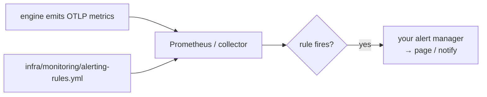

# Alerting

**Status:** Design accepted · **Phase:** 7 — Production Hardening · **Written:** 2026-07-21

## Why

The engine already exports traces and metrics over OTLP (the observability
slice), but nobody is *watched*. Alerting closes that: a small set of rules that
page a human when the three things that matter most go wrong — the engine is
failing requests, it is slow, or it is spending money faster than expected.

## What ships

Three rules in `infra/monitoring/alerting-rules.yml`, loaded into Prometheus (or
any Prometheus-compatible alerting backend):

| Alert | Fires when | Reads |
|---|---|---|
| `ASEPHighErrorRate` | over 5% of responses are 5xx for 5 min | `http_server_requests_total` |
| `ASEPHighRequestLatencyP95` | p95 request duration over 2s for 10 min | `http_server_duration_milliseconds_bucket` |
| `ASEPHighLLMSpend` | projected spend over $20/hour for 15 min | `llm_cost_usd_total` |

The first two read the request metrics the engine has always emitted. The third
reads a new counter: the `ModelRouter` now records `llm.cost.usd` and
`llm.tokens` on every completed call (by tier and model), so token spend is a
real series to watch and not just a number in the logs.

## The two honest caveats

- **Metric names follow the OTel → Prometheus convention.** OpenTelemetry
  instrument names (`http.server.requests`, `llm.cost.usd`) become Prometheus
  names by the standard mapping: dots to underscores, counters gain `_total`,
  the histogram's `ms` unit becomes `_milliseconds`. The reference collector
  config `infra/monitoring/otel-collector.yaml` pins exactly that mapping
  (`add_metric_suffixes: true`), so with it the rule names line up out of the
  box — receive the engine's OTLP, scrape the collector's `:9464/metrics`, and
  the series exist. If your pipeline drops unit or `_total` suffixes, rename in
  the rules to match — they are a template, not a lock-in.
- **The thresholds are starting points.** 5%, 2 seconds, $20/hour are
  reasonable opening values, not tuned ones. Real traffic is what calibrates a
  threshold so it catches trouble without crying wolf; treat the first weeks as
  the tuning window and adjust in the file.

## Boundaries

- **No alert manager is shipped.** Routing a fired alert to Slack, email, or
  PagerDuty is the operator's side — the rules produce the signal, the operator
  owns the delivery.
- **Rules, not dashboards.** Grafana dashboards are a separate, later artifact;
  these rules stand on their own.
- **The engine's OTLP export must be on** (`OTEL_ENABLED=1`,
  `OTEL_EXPORTER_OTLP_ENDPOINT` pointed at the collector) for any of these
  series to exist — the observability slice's contract.
