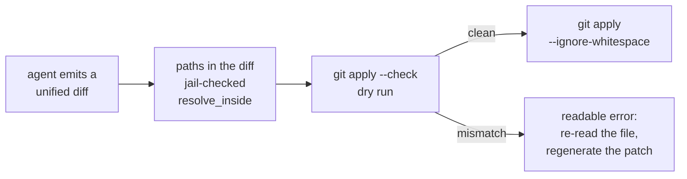

# The apply_patch Tool

**Status:** Design accepted · **Phase:** Agent Tools follow-up (declared in
the registry since Phase 1, unbound until now) · **Written:** 2026-07-17

## Why

Engineers had exactly one write tool: `write_file`, which replaces a whole
file. For a two-line fix in a 400-line module the model must reproduce all
400 lines — token-expensive, slow, and every reproduction is a chance to
drift from the original. A unified-diff `apply_patch` makes the edit the
size of the change.

## How

- **`git apply` does the work.** The workspace is already a git repository,
  and `git apply` is the battle-tested unified-diff engine — context
  matching, file creation and deletion, rename detection. No hand-rolled
  patcher.
- **Two jails, not one.** `git apply` itself rejects paths outside the
  working tree (its default `--unsafe-paths` refusal), and before git ever
  sees the patch, every path mentioned in it goes through the same
  `resolve_inside` jail as every other tool (ADR-0008) — defense in depth,
  and friendlier errors.
- **Prefix detection.** Models emit both `a/file` / `b/file` diffs (git
  style, `-p1`) and bare-path diffs (`-p0`); the tool detects which and
  tells git, so either form applies.
- **Dry run first.** `git apply --check` validates the whole patch before
  anything is touched — a patch either applies completely or not at all,
  never half. A context mismatch returns guidance the model can act on:
  re-read the file, regenerate the patch.
- **`--ignore-whitespace`** absorbs the whitespace drift models introduce
  when quoting context lines.

## Exit criterion

An engineer agent modifies an existing file with a small unified diff (both
prefix styles), creates a new file by patch, and is refused when the patch
targets a path outside the workspace or no longer matches the file. The
existing offline pipeline is unchanged (it keeps using `write_file`).

## Boundaries

- **No fuzzy application.** If context doesn't match, the answer is
  "regenerate", not "guess" — `--3way` merges are how silent corruption
  ships.
- **`write_file` stays.** Whole-file replacement is still right for new
  files the model authors from scratch and for small files.
- The offline (LLM_FAKE) engineer path keeps writing files directly — the
  patch tool is exercised by its own tests, not the golden pipeline.
