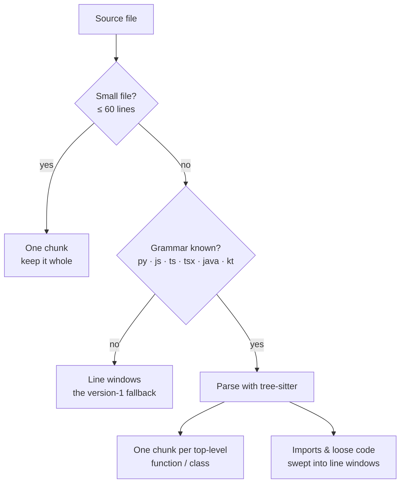

# AST-Aware Chunking

Phase 2 design note. Plain language; the task list lives in
[BACKLOG.md](../BACKLOG.md). Builds on
[REPOSITORY_INTELLIGENCE.md](REPOSITORY_INTELLIGENCE.md).

## The problem

Version 1 of the chunker cut every file into blind 60-line windows. A window
can slice a function in half — its first 40 lines in one chunk, its last 20 in
the next — so a search lands on "half a function," which reads poorly in a
citation and weakens the embedding (half a function means half the meaning).

## The fix: split where the code actually divides

[tree-sitter](https://tree-sitter.github.io) parses source into a syntax tree,
so we can split a file at its real boundaries — one chunk per top-level
function or class — instead of at arbitrary line counts. A whole function stays
whole.

The rules, in order (`engine/indexing/chunker.py`):

1. **Small files stay whole.** A file of 60 lines or fewer is a single chunk —
   there is nothing to cut, and one coherent unit embeds best.
2. **Known grammars split by definition.** For Python, JavaScript, TypeScript,
   TSX, Java, and Kotlin, each top-level function, class, interface, enum (and
   Java record / Kotlin object) becomes its own chunk, at its real line range. A
   definition longer than 200 lines is windowed so no chunk grows unbounded.
3. **Everything else is swept into windows.** Imports, module-level code, and
   the gaps between definitions are chunked with the version-1 line windows, so
   nothing is lost.
4. **Fallbacks are safe.** An unknown extension, an empty parse, or any parser
   error falls back to line windows — the chunker never fails a file.

The chunk record is unchanged — still `(path, language, start_line, end_line,
text)` — so the schema, the embedder, and hybrid retrieval need no changes. A
re-index is enough to pick up the better boundaries.

## Why tree-sitter

tree-sitter is error-tolerant (it still produces a tree for a file with a syntax
error) and ships prebuilt grammars for dozens of languages via
`tree-sitter-language-pack`. Each grammar is a one-line entry in the grammar
table plus its set of definition node types, so extending coverage is cheap —
Java and Kotlin were added exactly this way. Languages we have not wired up keep
working through the line-window fallback.

## What this is not (yet)

No method-level splitting inside a large class (the class is one chunk until it
crosses the 200-line cap); for Java and Kotlin, where methods live inside
classes, a whole top-level type is one chunk. The dependency graph and
incremental re-indexing are covered by their own design notes
([DEPENDENCY_GRAPH.md](DEPENDENCY_GRAPH.md),
[INCREMENTAL_INDEXING.md](INCREMENTAL_INDEXING.md)); the dependency graph
resolves Java/Kotlin imports by a fully-qualified `package` + declared-type
map (landed 2026-07-08).
