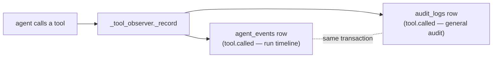

# Audit log — mirroring agent tool calls

**Status:** shipped · **Design note**

The platform has a general **audit log** (`audit_logs`, since the foundation
migration): rows of the shape *`actor_id` did `action` to `target`*, with the
detail in a JSONB `meta`. Until now it recorded one thing — a chat message
(`action = "chat.message"`). Every agent tool call, meanwhile, was written only
to the run timeline (`agent_events` as a `tool.called` event).

This change **mirrors** each tool call into the audit log, so "who did what"
across the platform — chat messages and agent actions alike — lives in one
queryable place, indexed by actor and action.

## What a tool-call row looks like

| Column | Value |
|---|---|
| `actor_id` | the run's owner — the person on whose behalf the agents act (`"system"` if no run context) |
| `action` | `"tool.called"` (the category; the specific tool is in `meta`) |
| `target` | the run id |
| `meta` | `{tool, agent, ok, task_id, args, result}` |

The `args` are the **summarized** arguments the timeline already computes — file
contents are replaced by their size (`"(5000 chars)"`), never stored verbatim —
and `result` is the first 200 characters. It reuses exactly what the
`tool.called` event carries, so the two can never disagree.

## Where it is written

The write rides the existing tool observer in `engine/agents/runner.py`. That
observer already opened a transaction to append the timeline event; the audit
row is added to the **same transaction** and committed together — no extra round
trip, and no way for one to be written without the other. The arguments are
summarized once and reused.

The acting user reaches the write through `audit_user_var`
(`engine/agents/audit.py`), a context variable set at each run entrypoint right
beside `provider_keys_var` — the same pattern that carries the owner's model
keys into the pipeline. A tool called with no run context records
`actor_id = "system"` rather than failing (`actor_id` is `NOT NULL`).

## Deliberate scope

- **The existing table, existing shape.** No new table, no new migration — the
  tool call is just another audited action. `build_audit_log` produces the same
  `AuditLog` model `chat.py` uses.
- **Run-scoped, not run-owned.** The row records the run as its `target` but
  carries no foreign key, so it is unaffected by run-history retention — a
  deleted run's timeline events cascade away, its audit rows remain.
- **Owner-scoped by RLS.** `audit_logs` is under row-level security like every
  other ownership-carrying table: the policy is owner-or-service on `actor_id`
  (migration 0024), so a session reads only its own audit rows and Postgres
  refuses the rest. The tool-call mirror is *written* under the service context
  (the observer's own session), so it is never blocked; a chat row is written by
  the user session and passes because `actor_id` is that user.
- **Not a user-facing feature.** There is no read endpoint yet; this is the
  durable record, not a UI. A future audit-viewer would read `audit_logs`
  filtered by `action`, and RLS would scope it to the caller automatically.
