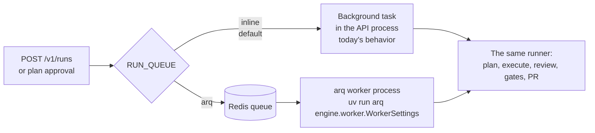

# Background Worker

Design note for *Agent Runtime — background worker entrypoint (arq)* (the last
blocking Phase 1 runtime item; ADR-0004 chose Redis + arq for jobs). Plain
language; the task list lives in [BACKLOG.md](../BACKLOG.md).

## The problem

Runs execute as background tasks *inside the API process*. That was the right
first step, but it couples two very different jobs: serving fast HTTP requests
and babysitting agent runs that can take many minutes. Restarting the API to
deploy a fix kills every run in flight (recovery resumes them, but only after
the restart), and one process can never scale the two workloads separately.

## The design: a queue in front, the same runner behind

One new seam, `engine/jobs.py`: the API dispatches "plan this run" / "execute
this run" through it. In `inline` mode (the default) dispatch runs the work in
the API process exactly as before — every existing test and the offline dev
loop are untouched. In `arq` mode dispatch enqueues a job on Redis and a
separate worker process (`engine/worker.py`) picks it up. If enqueueing fails
(Redis gone), dispatch falls back to inline with a warning — a broken queue
degrades to today's behavior, it never strands a run.

## Graceful shutdown — the checkpoint proof

Stopping the worker mid-run (SIGTERM/Ctrl-C) cancels the job's task. The
runner deliberately does **not** catch that cancellation (`_guarded` catches
`Exception`, and cancellation is not one), so the run is simply left where the
last commit put it: status in Postgres, task board in Postgres, commits in the
workspace. That is the Run Recovery checkpoint ([RUN_RECOVERY.md](RUN_RECOVERY.md))
doing its job.

arq re-queues the interrupted job, and both job functions are **re-entrant**:
before running, each one resets an interrupted run the same way startup
recovery does (a half-made plan is discarded and re-planned; in-progress tasks
go back to pending, done tasks keep their commits) and stamps the
`run.recovered` timeline event. So the sequence *stop the worker mid-run →
start it again → the run finishes* works with no human involved — which is
exactly the backlog's exit test.

## Who recovers what

| Mode | Interrupted runs are picked up by |
|---|---|
| `inline` | API startup recovery (unchanged) |
| `arq` | the queue itself — jobs stay on Redis until they finish, and the re-entrant job functions reset the run before resuming |

API startup recovery is therefore gated to `inline` mode: in `arq` mode the
API must not resume a run a healthy worker may still be executing.

## Boundaries

- Single worker at dev scale. Nothing prevents more later — jobs are
  idempotent-by-reset — but concurrent workers per run are out of scope.
- The queue carries only run ids, never payloads (the Postgres row is the
  job's state), mirroring the event bus philosophy.
- `inline` stays the default until a worker is actually part of the dev
  routine; flipping `RUN_QUEUE=arq` without a worker running would just park
  runs in the queue.
