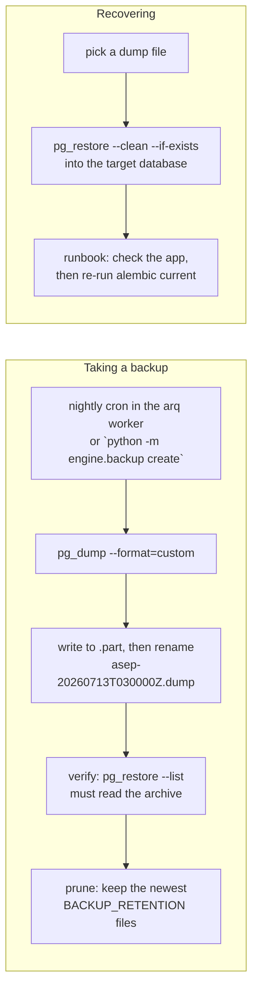

# Backups & Disaster Recovery

**Status:** Design accepted · **Phase:** 7 — Production Hardening · **Written:** 2026-07-13

## Why

Postgres is the platform's single source of truth: runs and their task boards,
plans, timelines, the knowledge graph and team memory, generated documents,
encrypted provider keys and integration connections. Today, losing that
database loses everything — there is no backup, and no practiced way back.

A backup that has never been restored is a hope, not a backup. So this slice
ships three things together: scheduled dumps, a **tested** restore path (the
test suite proves a restored database contains the data the original had), and
a written runbook a stressed human can follow at 3 a.m.

## How it works

Everything lives in `engine/backup.py` and drives the standard PostgreSQL
tools (`pg_dump`, `pg_restore`) as subprocesses — no custom dump format, so
any Postgres operator can work with the files.



- **Format:** `pg_dump --format=custom` — compressed, restorable table-by-table,
  and `pg_restore --list` can prove the archive is readable without touching a
  database. Verification runs after every dump; a backup that cannot even list
  its own contents is deleted and reported as a failure, never kept.
- **Atomic files:** the dump is written to a `.part` file and renamed only when
  `pg_dump` exits cleanly, so a crash mid-dump never leaves a plausible-looking
  broken backup in the directory.
- **Retention:** after each successful dump the newest `BACKUP_RETENTION`
  files are kept and older ones deleted. Pruning never runs after a failure —
  a failing dump must not eat the good backups that came before it.
- **Schedule:** with `BACKUP_ENABLED=1`, the arq worker (the same process that
  executes queued runs) takes a backup every night at 03:00 (the worker's
  clock — UTC in containers) via arq's cron.
  The CLI covers everything else: `create`, `verify <file>`, `restore <file>`.
- **Finding the tools:** `pg_dump`/`pg_restore` are looked up in `PG_BIN_DIR`
  first, then on `PATH`, then (Windows dev) under
  `C:\Program Files\PostgreSQL\<newest>\bin`. A newer client dumping an older
  server is the supported direction, so a local PostgreSQL 18 install backs up
  the dockerized Postgres 16 fine.

## Off-host copies (`BACKUP_S3_BUCKET`)

A dump on the same disk as the database survives a bad migration, not a dead
machine. Setting `BACKUP_S3_BUCKET` adds one step to `create`: after the local
dump is written, verified, renamed, and locally pruned, it is uploaded to
S3-compatible object storage, and the remote copies are pruned to the same
`BACKUP_RETENTION` count.

```mermaid
flowchart LR
    E[local dump verified,\nrenamed, pruned] --> S{BACKUP_S3_BUCKET set?}
    S -->|no| L[local only\n(unchanged)]
    S -->|yes| U[upload asep-*.dump\nto the bucket]
    U --> P[prune remote copies\nto BACKUP_RETENTION]
```

- **Any S3-compatible store.** `boto3` talks to AWS S3, MinIO, Cloudflare R2,
  or Backblaze the same way; `BACKUP_S3_ENDPOINT_URL` points it at a
  non-AWS endpoint (the dev compose MinIO, or a self-hosted one). The dev
  stack already runs MinIO, so off-host backups can be exercised locally.
- **Credentials the standard way.** When `BACKUP_S3_ACCESS_KEY_ID` /
  `BACKUP_S3_SECRET_ACCESS_KEY` are set they are used explicitly (dev MinIO);
  when they are empty `boto3` falls back to its default chain, so a production
  pod uses its IAM role and no secret is stored at all.
- **Local first, always.** The upload runs only after the local dump is safe on
  disk. If the upload fails the local backup is already kept and the error is
  raised so the nightly job surfaces it — a network blip never costs a backup.
- **Off by default.** No bucket configured means the behaviour above is exactly
  the previous local-only flow; nothing changes for a single-machine
  deployment until it opts in.

The Kubernetes side of this — a persistent volume for `BACKUP_DIR` on the
worker, for deployments that prefer a mounted volume over object storage — is
the remaining Deploy-workstream piece.

## Exit criterion

The test suite — offline, in CI — writes a row, takes a backup, restores it
into a scratch database, and reads the row back from the copy. The restore
path is exercised on every push, not discovered during an outage. The off-host
upload is exercised against the dev MinIO when it is running, and skipped in CI
(which has no object store), so it never blocks a build.

## Honest boundaries

- **Off-host copies are opt-in.** Left unconfigured, the backup directory is a
  local disk and burns down with the machine. `BACKUP_S3_BUCKET` (above) ships
  each dump to object storage; a mounted persistent volume for `BACKUP_DIR` is
  the alternative for volume-based deployments and remains on the backlog.
- **A dump is useless without `ENGINE_ENCRYPTION_KEY`.** Provider keys and
  integration configs are AES-GCM encrypted at rest; the runbook's first rule
  is that the encryption key is stored separately from the backups.
- **Point-in-time recovery is out of scope.** Nightly dumps mean up to a day
  of loss; WAL archiving (PITR) is a deliberate non-goal until real traffic
  justifies it.
- **Only Postgres is covered.** Run workspaces are reproducible from git;
  MinIO artifacts are re-generatable; better-auth tables live in the same
  database, so they ride along in every dump.

## Runbook

The step-by-step recovery procedure lives in
[docs/runbooks/DISASTER_RECOVERY.md](../runbooks/DISASTER_RECOVERY.md).
