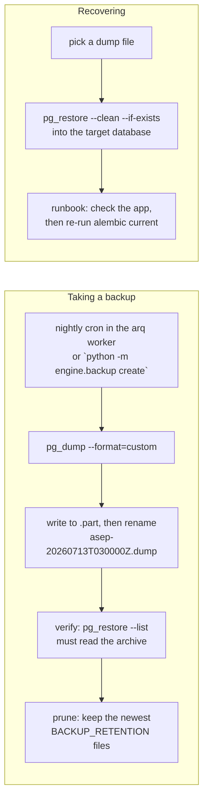

# Backups & Disaster Recovery

**Status:** Design accepted · **Phase:** 7 — Production Hardening · **Written:** 2026-07-13

## Why

Postgres is the platform's single source of truth: runs and their task boards,
plans, timelines, the knowledge graph and team memory, generated documents,
encrypted provider keys and integration connections. Today, losing that
database loses everything — there is no backup, and no practiced way back.

A backup that has never been restored is a hope, not a backup. So this slice
ships three things together: scheduled dumps, a **tested** restore path (the
test suite proves a restored database contains the data the original had), and
a written runbook a stressed human can follow at 3 a.m.

## How it works

Everything lives in `engine/backup.py` and drives the standard PostgreSQL
tools (`pg_dump`, `pg_restore`) as subprocesses — no custom dump format, so
any Postgres operator can work with the files.

- **Format:** `pg_dump --format=custom` — compressed, restorable table-by-table,
  and `pg_restore --list` can prove the archive is readable without touching a
  database. Verification runs after every dump; a backup that cannot even list
  its own contents is deleted and reported as a failure, never kept.
- **Atomic files:** the dump is written to a `.part` file and renamed only when
  `pg_dump` exits cleanly, so a crash mid-dump never leaves a plausible-looking
  broken backup in the directory.
- **Retention:** after each successful dump the newest `BACKUP_RETENTION`
  files are kept and older ones deleted. Pruning never runs after a failure —
  a failing dump must not eat the good backups that came before it.
- **Schedule:** with `BACKUP_ENABLED=1`, the arq worker (the same process that
  executes queued runs) takes a backup every night at 03:00 (the worker's
  clock — UTC in containers) via arq's cron.
  The CLI covers everything else: `create`, `verify <file>`, `restore <file>`.
- **Finding the tools:** `pg_dump`/`pg_restore` are looked up in `PG_BIN_DIR`
  first, then on `PATH`, then (Windows dev) under
  `C:\Program Files\PostgreSQL\<newest>\bin`. A newer client dumping an older
  server is the supported direction, so a local PostgreSQL 18 install backs up
  the dockerized Postgres 16 fine.

## Exit criterion

The test suite — offline, in CI — writes a row, takes a backup, restores it
into a scratch database, and reads the row back from the copy. The restore
path is exercised on every push, not discovered during an outage.

## Honest boundaries

- **The backup directory is a local disk.** If the machine burns down, the
  backups burn with it. Shipping dumps off-host (S3/MinIO or the K8s
  CronJob's volume) belongs to the Deploy workstream and is logged in the
  backlog.
- **A dump is useless without `ENGINE_ENCRYPTION_KEY`.** Provider keys and
  integration configs are AES-GCM encrypted at rest; the runbook's first rule
  is that the encryption key is stored separately from the backups.
- **Point-in-time recovery is out of scope.** Nightly dumps mean up to a day
  of loss; WAL archiving (PITR) is a deliberate non-goal until real traffic
  justifies it.
- **Only Postgres is covered.** Run workspaces are reproducible from git;
  MinIO artifacts are re-generatable; better-auth tables live in the same
  database, so they ride along in every dump.

## Runbook

The step-by-step recovery procedure lives in
[docs/runbooks/DISASTER_RECOVERY.md](../runbooks/DISASTER_RECOVERY.md).
