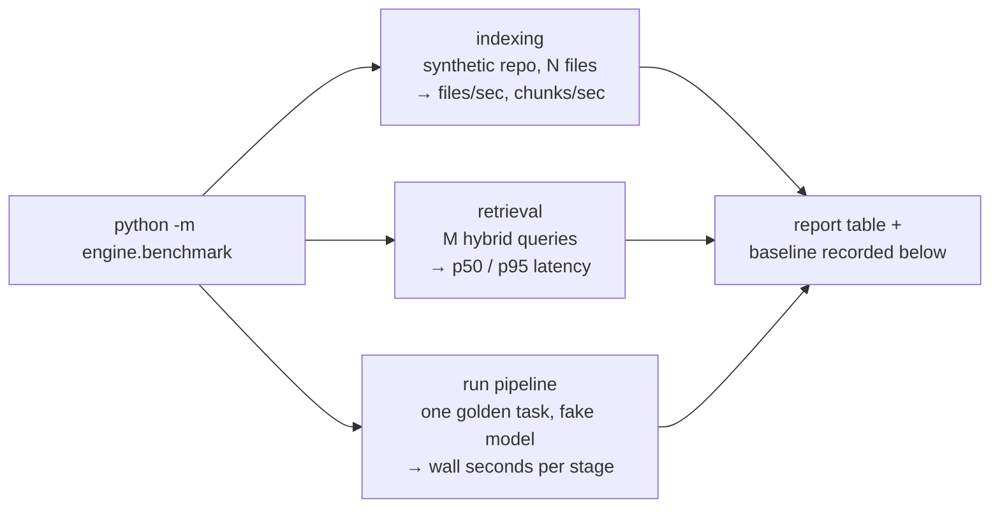

# Benchmarks

Phase 7 design note — performance baselines for the hot paths, the first half
of the Benchmarks & Security Audit workstream in
[PRODUCTION_HARDENING.md](PRODUCTION_HARDENING.md).

## The problem

Nobody has ever measured the platform. "Indexing is fast enough" and the Helm
chart's resource limits are guesses. A baseline turns both into numbers: a
future change that makes indexing 3× slower shows up as a number moving, not
as a vague feeling — and the deploy limits get informed by data.

## Shape

One CLI, three measurements, all offline (`LLM_FAKE=1`, fake embeddings):

- **Indexing** — a synthetic repository of N generated Python files (default
  120; small enough for CI patience, large enough to dominate fixed costs) is
  git-committed, registered, and indexed through the real
  `index_repository` path: clone, tree-sitter chunking, embedding, Postgres
  writes. Reported as total seconds, files/sec, chunks/sec. A second pass
  over the unchanged repository measures the incremental no-op — the
  re-indexing promise from Phase 2, now as a number.
- **Retrieval** — the golden questions run against the indexed fixture
  through `retrieve_chunks` (hybrid vector + FTS with RRF), each repeated
  enough for a stable p50/p95 per-query latency.
- **Run pipeline** — one golden task through the real plan → approve →
  execute → review loop with the fake model (`run_golden_task`, the existing
  evaluation harness). The fake model answers instantly, so the number
  isolates *our* machinery: DB round-trips, workspace git operations, event
  writes — exactly the overhead a real run pays on top of model latency.

## Decisions

- **Offline by construction.** Real-model numbers measure the provider, not
  the platform, and cost money on every run. `LLM_FAKE=1` numbers are stable,
  free, and regression-comparable — the same reasoning as the golden-task
  evaluation seed.
- **A CLI, not a test.** Benchmarks answer "how fast", tests answer "still
  correct". Wiring timing assertions into pytest invites flaky failures on
  slow CI runners. The suite keeps one smoke test proving the harness runs
  and returns sane shapes at tiny sizes; the numbers themselves live here.
- **Baselines are recorded in this document** (below, with date and machine),
  so a future run has something to diff against. Rerun after any change that
  touches the hot paths; update the table in the same PR.
- **Feeding the Helm chart:** the chart's resource limits stay placeholders
  until numbers justify changing them; the logged backlog follow-up stays
  open until a run under realistic load (not this synthetic baseline) sizes
  them.

## Exit criterion (this slice)

`uv run python -m engine.benchmark` prints all three baselines against the
dev database, and the first baseline table is recorded below. A smoke test
keeps the harness importable and runnable at tiny sizes on every push.

## Baselines

**2026-07-15 · dev machine** (Windows 11, Docker Desktop, Postgres 16 in
compose, OneDrive checkout — a deliberately unflattering environment; a
Linux server will beat every number here):

| Path | Baseline |
|---|---|
| Indexing (full) | 121 files, 120 chunks in **1.83 s** — 66 files/s, 66 chunks/s |
| Indexing (unchanged re-index) | **0.73 s** — the incremental no-op, ~2.5× faster than full |
| Retrieval (hybrid, fixture) | 50 queries: **p50 103 ms, p95 121 ms** per query |
| Run pipeline (fake model) | one golden task end-to-end in **19.7 s** |

Reading the numbers: the run-pipeline figure *includes* a real Docker
sandbox pass (container pull/start, dependency install, pytest inside) and
two git pushes — the platform's own bookkeeping is a small slice of it.
Retrieval's ~100 ms is dominated by the two-arm hybrid query (vector +
full-text + RRF fusion) on a cold Postgres over Docker's network on
Windows; the HNSW index keeps it flat as chunk counts grow, which is the
property that matters.
