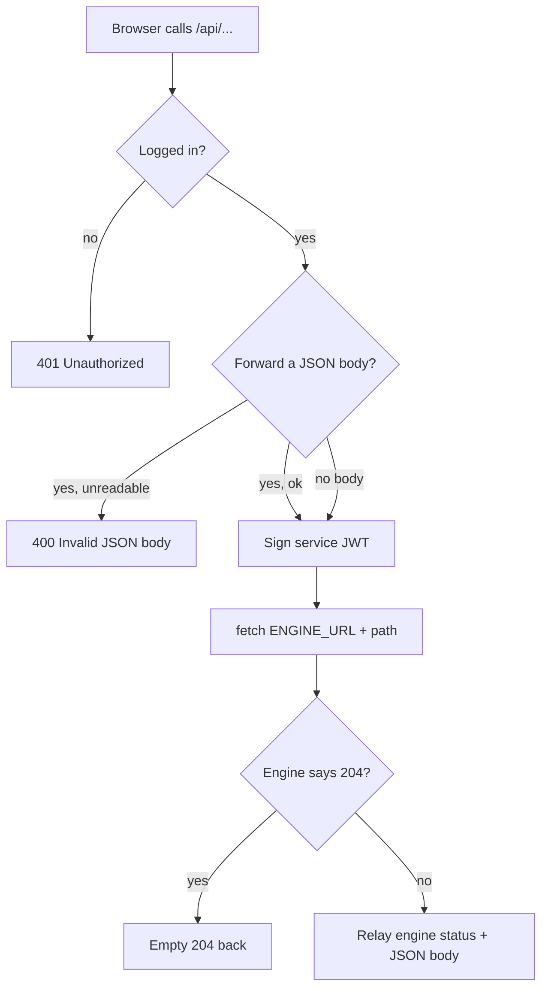

# The BFF proxy helper

**Status:** Implemented · **Design note**

## What this is about

The web app never talks to the engine directly from the browser. Every call
goes through a **Backend-for-Frontend (BFF)** route under
`apps/web/src/app/api/…`. Each of those routes does the same four things:

1. Check the browser's login session (better-auth). No session → **401**.
2. Sign a short-lived service JWT that tells the engine who is calling
   (ADR-0002; [SIGN_IN_AND_ORGANIZATIONS.md](SIGN_IN_AND_ORGANIZATIONS.md)).
3. Forward the call to the engine at `/v1/…` with that token attached.
4. Relay the engine's status code and JSON body back to the browser.

We had this exact block copied into ~40 route files. Copy-paste is how bugs
drift: earlier this month one route forgot to guard `upstream.json()`, and
threw when the engine returned an empty error body — a bug that could not have
happened if there were one place to get it right. This note describes the one
place: `apps/web/src/lib/bff.ts`.

## The flow



## The helper

```ts
proxyToEngine(req, path, options?)
```

- `req` — the incoming request (for the session cookie and, if asked, the body).
- `path` — the engine path starting at `/v1/…`. The caller builds it, so it
  owns encoding any dynamic segment and any query string
  (`/v1/runs/${encodeURIComponent(id)}/report`).
- `options`:
  - `method` — defaults to `GET`.
  - `forwardBody` — read the request's JSON body and forward it verbatim;
    an unreadable body is a **400** before the engine is ever called.
  - `orgRole` — the caller's organization role, signed into the token only by
    the destructive routes that gate on it
    ([ORGANIZATION_ROLES.md](ORGANIZATION_ROLES.md)). Omitted everywhere else,
    so the token stays lean.

A `204 No Content` from the engine is relayed as a bodyless 204; anything else
is relayed as `{ status, <json> }`, with the JSON read guarded so an empty or
non-JSON error body relays as `{}` instead of throwing.

A route now reads as its one distinguishing line — the engine path and the
method:

```ts
// GET /api/conversations
export const GET = (req: Request) => proxyToEngine(req, "/v1/conversations");

// POST /api/runs/[id]/decision  (forwards the approve/reject body)
export async function POST(req: Request, { params }: RouteParams) {
  const { id } = await params;
  return proxyToEngine(req, `/v1/runs/${encodeURIComponent(id)}/decision`, {
    method: "POST",
    forwardBody: true,
  });
}
```

## What stays hand-written

Three routes don't fit the "relay a JSON body" shape and keep their own code:

- **`api/auth/[...all]`** — the better-auth handler itself, not a proxy.
- **`api/chat`** and **`api/runs/[id]/events/stream`** — Server-Sent Events.
  They pipe the engine's streaming body straight through and answer a failed
  upstream with **502**, so they share the session-and-token opening but not
  the response handling. Folding streaming into the helper would complicate it
  for two callers; they stay explicit and readable.

## Boundaries

- **No behavior change.** The helper reproduces what the routes already did:
  same 401, same 400-on-bad-body, same 204 passthrough, same status relay. The
  only deliberate tightening is that every route now guards the JSON read
  (previously all but one threw on an empty body) — strictly safer.
- **The token is unchanged.** `signServiceToken` still decides what the JWT
  carries; the helper only passes `orgRole` through when a route supplies it.
- **A destructive route computes `orgRole` before the session is re-checked
  inside the helper.** On an *unauthenticated* request to such a route that is
  one wasted `getActiveMember` call (it returns null) before the 401 — no
  security effect, and the common authenticated path is unchanged.
- **Tested directly.** `bff.test.ts` mocks the session and `fetch` and asserts
  the 401, the 400, the 204 passthrough, the status/body relay, and that
  `forwardBody` attaches the body with a JSON content-type — the first
  automated coverage these routes have had.
