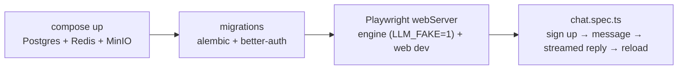

# CI End-to-End Smoke — the Playwright test runs on every push

**Status:** Design accepted · **Phase:** Debt cleanup (debt register: "Playwright
smoke not in CI") · **Written:** 2026-07-19

## The problem

The repository has had a real end-to-end test since the walking skeleton —
`apps/web/e2e/chat.spec.ts` signs up, sends a message, watches the fake-model
reply stream in, and reloads to prove the conversation persisted. But it only
ran on a developer's machine (`pnpm e2e` with the compose stack up). CI checked
lint, types, unit tests, and the engine suite — never the seam where the
browser, the BFF, the engine, and Postgres actually meet. A broken sign-up form
or a mis-wired proxy route would pass every existing CI job.

## The design

One new CI job runs the existing smoke exactly the way a developer does —
same compose file, same migrations, same Playwright config. Nothing is
CI-specific except the environment being fresh every time.

- **The compose dev stack is the test bed.** `docker compose up -d --wait` on a
  fresh volume runs `infra/docker/postgres-init/` — the NOSUPERUSER `asep`
  role, the `asep_api` role, and the database exist before the first
  migration, the same way they do on a developer machine.
- **Every default already points at the stack.** The engine's pydantic
  defaults and the web app's `env.ts` fallbacks both say
  `localhost:5433` / `asep:asep` — the job sets `LLM_FAKE=1` and nothing else.
  No secrets, no provider key: the fake model streams a canned reply, which is
  exactly what the spec asserts on.
- **Playwright starts the servers itself.** The `webServer` blocks in
  `playwright.config.ts` boot the engine (`uv run python -m engine.serve`) and
  the web dev server, and wait for `/healthz` and `/` before the test runs —
  the CI job needs no sleep-and-hope steps.
- **Chromium only.** The smoke proves the stack is wired, not that three
  browser engines render it; one browser keeps the job a few minutes long.
- **Failures leave evidence.** The config keeps a trace on failure, and the
  job uploads Playwright's test-results directory as an artifact so a red run
  can be replayed locally with `playwright show-trace`.

## What the smoke caught on day one: migrations were silently rolling back

Wiring the smoke to a real, migrated database immediately found a bug the
whole test suite had been blind to. `conftest.py` builds its schema with
`Base.metadata.create_all`, not alembic — so a green test run said nothing
about whether `alembic upgrade head` actually *persists*. It did not.

Since migration 0018 added deny-by-default row-level security, the alembic
`env.py` opened the migration's transaction with a
`SELECT set_config('app.service', '1', …)` — the DDL and the service context
have to share one transaction, or RLS blocks the data migrations. But that
first statement opened the connection's transaction, so alembic's own
`begin_transaction()` *joined* it instead of owning it, and a joined
transaction is never committed on exit. Every `alembic upgrade` since had run
all the migrations, logged success, exited zero — and rolled the whole thing
back on close. The dev database sat at 0017 while the code believed it was at
0022; nobody noticed because the tests never used alembic and CI's upgrade
step only checked the exit code.

The fix is one line in `env.py`: after the migrations run, commit the
transaction we ourselves left open. The smoke is what would have kept this
honest all along — the CI job runs the real migrations against the real
stack, so a migration that does not persist now fails a build.

## Also closed here: the `git_branch` ghost tool

The agent registry declared `git_branch` in `_GIT_TOOLS` since Phase 1, but no
implementation was ever built — `schemas_for()` silently dropped it, so no
model ever saw it. That was the right outcome for the wrong reason: the run
pipeline creates the run's branch itself (`workspace/manager.py`), and an
agent-facing branch tool would only let an agent wander off the branch the
reviewer and the PR are watching. The declaration is now gone, and a registry
test asserts the stronger property: **every tool a role declares is
implemented** — a typo in a tool policy is a loud test failure, not a tool
that silently never appears.

## Honest boundaries

- **Dev servers, not production builds.** The job runs `next dev` and the
  engine straight from source — the same thing `pnpm e2e` runs locally. A
  production-build smoke (standalone Next.js, the Docker images) would be a
  different, slower job; the Helm chart's template check covers that shape.
- **One spec.** The smoke proves the stack wires up end to end; it is not a
  regression suite for every page. New specs can join `apps/web/e2e/` and run
  in the same job for free.
- **The fake model only proves plumbing.** A real-model evaluation stays
  operator-gated on a provider-key secret (see the backlog's operator items).
