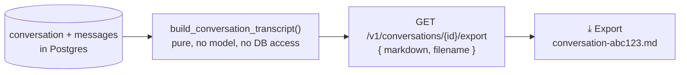

# Exporting a Conversation — a shareable transcript

**Status:** Design accepted · **Phase:** 8 follow-up · **Written:** 2026-07-25

## The problem

A chat conversation with the codebase — questions, answers, the citations that
grounded them — lives only inside the app. To share an answer with a teammate,
or keep a record of what you learned, you'd copy-paste turn by turn and lose the
citations. The run report already solved this for agent runs; chat had no
equivalent.

## The design

`GET /v1/conversations/{id}/export` returns a plain-English **markdown**
transcript built from the conversation and its messages. Each conversation in
the chat sidebar gets a **⤓** button that saves it as `conversation-<id>.md`.

- **Pure and offline, like the run report.** `engine/conversation_export.py::
  build_conversation_transcript(conversation, messages)` is a pure function —
  no model call, no network, no database of its own. It renders the title, then
  each turn as **You:** / **Assistant:** in order, listing an assistant turn's
  citations as `path:start–end` under the answer. Trivially unit-testable, and it
  parallels `reporting.py` deliberately.
- **Owner-scoped, personal.** The endpoint loads the conversation through the
  same `_owned_conversation` check every conversation route uses — a conversation
  is personal, never org-shared (ORGANIZATION_SHARING.md), so missing and
  not-yours both return 404.
- **No new storage.** Built from the live rows on request, so it always reflects
  the current conversation. The message read is shared with `list_messages` via
  a small `_conversation_messages` helper (one query, two callers).

## Boundaries

- **Markdown only.** Like the run report — markdown travels everywhere and needs
  no dependency; a PDF/HTML render is a later option.
- **Persisted turns only.** The transcript is the stored user/assistant messages
  and their citations. The live-only "recalled memory" hints shown while
  answering (RecalledMemoryRef) aren't persisted, so they aren't in the export —
  the same boundary the chat history itself has.
- **The answer's citations, not the sources' contents.** Each citation is a
  `path:line` reference, not the quoted code — enough to find the source, keeping
  the transcript readable.
