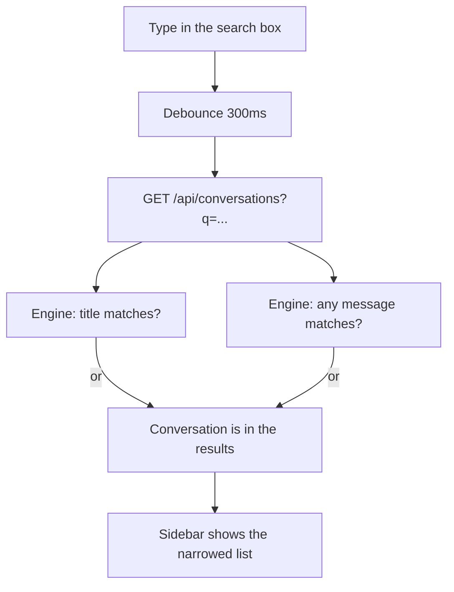

# Search your conversations

**Status:** Implemented · **Design note**

## What this is about

The chat sidebar lists your conversations, newest first, capped at 50. Once you
have more than a screenful there is no way to find "the chat where I worked out
the retrieval bug" short of scrolling and guessing from titles. This adds a
search box: type a word, and the list narrows to the conversations that mention
it. It is the chat parallel to [searching the runs list](RUN_SEARCH.md).

## What "mention it" means

A conversation matches if the text appears in **either its title or any of its
messages**. Titles alone would be too weak — they are short and often
auto-derived — so the search also looks inside the messages, which is where the
thing you actually remember was said.

## The rule, precisely

`GET /v1/conversations` gained an optional `q`:

- **Case-insensitive substring**, matched with `ILIKE '%…%'`.
- The user's `%`, `_`, and `\` are **escaped** before the match, so searching
  `100%` looks for the literal text, not a wildcard — the same escaping the run
  search uses.
- The message match is an `EXISTS` subquery (`this conversation has a message
  whose content matches`), so a conversation appears at most once regardless of
  how many of its messages hit.
- A blank query is a **no-op** — the full list comes back.
- Ownership is unchanged: the query still filters to the caller's own
  conversations first (they are personal, never organization-shared —
  [ORGANIZATION_SHARING.md](ORGANIZATION_SHARING.md)), so search can only ever
  narrow what you could already see, never widen it.

The result stays ordered by most-recently-updated and capped at 50.

## The path down

- **Engine** — `list_conversations` composes the `q` filter onto the existing
  owner clause (`engine/api/conversations.py`).
- **BFF** — `api/conversations` forwards the one known `q` param through the
  shared [`proxyToEngine`](BFF_PROXY.md) helper.
- **Web** — the chat sidebar gained a debounced (300ms) search box above the
  list; `refreshConversations` carries the current query, so the list stays
  filtered as you rename, delete, or start a new chat.

## Boundaries

- **Search never leaves your conversations.** The owner filter is applied
  before `q`, and Postgres row-level security enforces it independently.
- **No new index.** A plain `ILIKE` over the caller's own (capped) conversations
  and their messages is well within budget at this scale; if a hosted,
  many-message deployment ever made it slow, the upgrade path is a generated
  full-text column on `messages` and a `to_tsquery` match (the shape the
  repository and knowledge search already use) — noted, not built.
