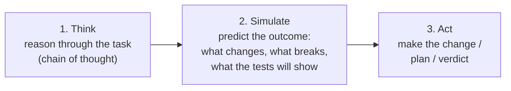

# Deliberate Reasoning — think, then simulate, then act

**Status:** Design accepted · **Phase:** 8 — Deliberate Reasoning (wrap-up) ·
**Written:** 2026-07-22

## The problem

Every agent role runs through one shared loop (`agents/loop.py::run_tool_loop`):
the model is called, it asks to run tools, the results come back, and it stops
when it stops asking. The role prompts are terse and method-focused — "read the
surrounding code, make the smallest change, commit clearly" — but **none of them
ask the model to think first**. An agent reads a task and immediately starts
editing. That wastes turns on false starts and leaves no visible rationale for
*why* it did what it did.

## The change

Each role now reasons before it acts. Not a new pipeline step, not an extra
model call — a short, uniform instruction added to every role's system prompt:

- **Think** — before touching anything, work through the task in the open: what
  the request really asks, which files matter, the conventions to match, the
  smallest change that does it.
- **Simulate** — predict what the intended action will do *before* doing it:
  what the diff changes, what could break, what the tests will show, whether the
  plan actually covers the request. This is the "simulation" — a dry run in the
  model's head, not a separate execution.
- **Act** — only then make the change, produce the plan, or give the verdict.

The three steps are one block, shaped the same across all nine roles so they
read consistently, but pointed at each role's real work — engineers simulate the
diff and its tests, the Product Manager and Scrum Master simulate whether the
plan covers the request, the Reviewer simulates how the change behaves at
runtime, the Technical Writer simulates whether a reader will follow the prose.

## Why prompt-level

The three options were: bake reasoning into the prompt, add a separate
reasoning/simulation LLM turn, or produce a typed structured prediction that is
validated before acting. Prompt-level won because it is the cheapest and least
invasive that still gets the behavior:

- **No extra LLM calls, no latency, no cost.** The reasoning rides in the
  model's own first turn — it thinks out loud, then calls its tools in the same
  response the loop already expects.
- **No pipeline change.** `run_tool_loop`, the supervisor, the registry, and the
  event schema are all untouched. The whole change is nine Markdown files.
- **Already captured.** Prompt edits are guarded by the prompt-snapshot contract
  ([PROMPT_SNAPSHOTS.md](PROMPT_SNAPSHOTS.md)): the change is recorded in
  `prompt_snapshots.json` and versioned per run, so a run's exact reasoning
  instructions are always recoverable.

A separate reasoning turn would double the model calls on every task for a
marginal gain; a typed simulation would be real engineering (a schema, a
validator, a new event type) for a wrap-up phase that wanted quality, not
surface area. Those stay open as future refinements if the reasoning ever needs
to be machine-checked rather than just present.

## Honest boundaries

- **The offline suite is unaffected.** `LLM_FAKE=1` returns a canned reply that
  does not depend on prompt text, so no behavioral test changes — the prompt
  edits are proven only structurally (the registry test still sees a valid
  prompt; the snapshot test records the new hashes).
- **The reasoning only *runs* under a real model.** Its actual effect on run
  quality is exercised by the operator-gated real-model evaluation workflow
  (`.github/workflows/evaluation.yml`, [EVALUATION.md](../EVALUATION.md)), not by
  unit tests.
- **The Supervisor routes deterministically** (no model call for routing); its
  reasoning directive only shapes the short summaries and failure notes it
  writes, and the routing itself is unchanged.
- **Reasoning is not persisted as its own artifact.** It appears in the model's
  turn and flows into the normal timeline; a dedicated `agent.reasoning` event
  or a saved chain-of-thought trace would be the next step if the rationale
  needs to be surfaced on the run page on its own.
