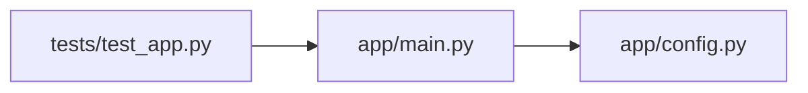

# Dependency / Architecture Graph

Phase 2 design note. Plain language; the task list lives in
[BACKLOG.md](../BACKLOG.md). Builds on
[REPOSITORY_INTELLIGENCE.md](REPOSITORY_INTELLIGENCE.md).

## The idea

The index already tells you *where* a piece of code is. The dependency graph
tells you *how the files connect* — which file imports which — so you can see a
repository's shape at a glance: the hubs everything depends on, the leaves,
and the layers between.



## How it is built

We already clone and parse every file while indexing, so the graph is computed
in the same pass — no extra clone.

- **Extract** — for each Python, JavaScript, TypeScript, TSX, Java, and Kotlin
  file, tree-sitter finds the real `import` / `from … import` statements (not
  ones hiding in comments or strings). `engine/indexing/dependency_graph.py`.
- **Resolve** — an import is kept only when it points at *another file in the
  same repository*. Python dotted modules (`app.config`, and relative `.config`)
  resolve to `app/config.py` or a package `__init__.py`; JavaScript/TypeScript
  relative specifiers (`./config`, `../lib/x`) resolve by trying the usual
  extensions and `index` files. Java and Kotlin imports name a fully-qualified
  type (`com.demo.util.Helper`), not a path, so a first pass indexes each file's
  `package` and the types it declares into a name→file map; an import resolves by
  looking its name up there. A wildcard (`com.demo.util.*`) links to every file
  in that package, and a static/member import (`com.demo.util.Const.MAX`) falls
  back to its declaring type. Imports of third-party packages resolve to nothing
  and are dropped — the graph is the repository's *own* structure.
- **Store** — edges land in a `code_edges` table (`source_path`, `target_path`,
  `kind`), replaced on every re-index exactly like chunks (migration 0007).

## The API

`GET /v1/repositories/{id}/graph` returns the graph ready to draw:

```json
{
  "nodes": [{ "path": "app/main.py", "language": "python",
              "in_degree": 1, "out_degree": 1 }],
  "edges": [{ "source": "app/main.py", "target": "app/config.py" }]
}
```

Nodes are the indexed files; `in_degree` / `out_degree` count how many files
import a file and how many it imports, so the view can size or sort by
importance. Owner-scoped like the rest of the repositories API.

## The view

The repositories page gains a **Dependencies** panel. With no graph library in
the web app, it draws an inline SVG: nodes on a circle, directed edges with
arrowheads, each node labelled by file name and sized by how many files depend
on it. Deterministic layout (same repository, same picture), so it needs no
physics simulation and no dependency.

## What this is not (yet)

Symbol-level edges (function-calls-function), cycle detection, and clustering by
folder are later refinements. Only first-party imports are drawn — the graph is
about the repository's own architecture, not its package manifest. Java/Kotlin
resolution matches by package + declared type, so a type imported from outside
the repository (or one whose declaration the parser missed) simply yields no
edge, same as any third-party import.
