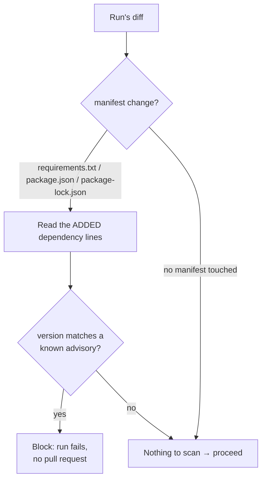

# Dependency Vulnerability Scanning

Phase 3 design note. Plain language; the task list lives in
[BACKLOG.md](../BACKLOG.md). A sibling of the secrets gate
([SECRETS_SCANNING.md](SECRETS_SCANNING.md)) in the Security Scanning workstream.

## The problem

A run can add a dependency with a known security hole — an old `lodash`, a
vulnerable `requests`. The secrets gate catches leaked keys; this gate catches
known-vulnerable *packages* the run pulls in, before the pull request opens.

## How it works

Like the secrets scanner, this reads only the **added** lines of the run's
unified diff — a vulnerable dependency already in the repository is not this
run's to block. For each recognized manifest it extracts `(package, version)`
pairs and checks them against a **curated, offline advisory list**: each advisory
names an ecosystem, a package, and a vulnerable version range (a PEP 440
`SpecifierSet`, e.g. `<4.17.21`). A version inside the range is a finding, and
any finding fails the run.

Recognized manifests:

| File | Ecosystem | What is read |
|---|---|---|
| `requirements.txt` (any `*requirements*.txt`) | PyPI | `name==version` exact pins |
| `package.json` | npm | `"name": "version"` dependency lines (a leading `^`/`~`/range is stripped to the base version) |
| `package-lock.json` | npm | each entry's resolved `"version"`, paired with its `node_modules/<name>` key |

Package names are normalized before lookup (PyPI per PEP 503: lowercase, runs of
`-_.` collapsed to `-`; npm: lowercase).

## Why a curated list, not a live feed

The gate must be **deterministic and offline** — the same property that lets the
secrets scanner run in tests without network. A curated list of high-confidence
advisories delivers that today; a match is a known-bad exact version, so a
finding is high-confidence and blocking is safe. Swapping in a live feed
(OSV.dev, GitHub Advisory) is future work, tracked in the debt register.

## Scope and limits (today)

- **Only exact/base versions are judged.** A loose PyPI spec like `requests>=2`
  is not flagged (the installed version is unknown until resolved); pinned
  `==` and lockfile-resolved versions are.
- **PEP 440 comparison is used for both ecosystems.** It matches npm semver for
  ordinary `x.y.z` versions; exotic npm pre-release semantics are out of scope.
- **No Poetry/pyproject dependency tables yet** — `requirements.txt` and the npm
  manifests cover the common cases; pyproject dependency parsing is future work.

## Settings

No new settings. The gate always runs; it is disabled only by the absence of a
matching advisory. The curated list lives in
`engine/security/dependency_scanner.py`.
