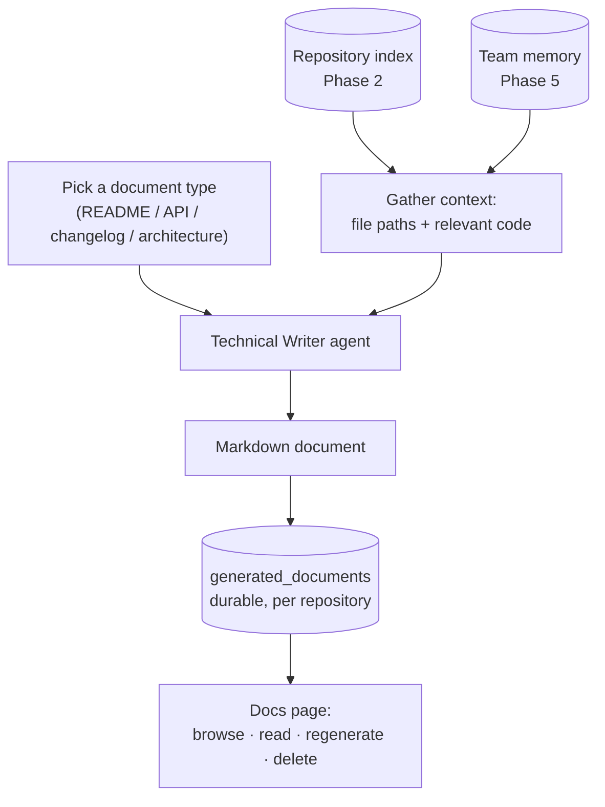

# Documentation Suite

First slice of Phase 6 (Workspace & Integrations). Plain language; the task list
lives in [BACKLOG.md](../BACKLOG.md).

## The problem

The platform can read a repository (Phase 2), plan work on it (Phase 4), and
remember what happened (Phase 5). What it cannot do yet is **write about the
code for the humans** — the README that explains what the project is, the API
reference that lists its endpoints, the changelog that says what changed, the
architecture guide that explains how the pieces fit. Today a person writes all
of that by hand, and it goes stale the moment the code moves.

The documentation suite gives the platform a **Technical Writer**: a new agent
role that reads the indexed repository and produces a document — a README, an
API reference, a changelog, or an architecture overview — that a person can
read, keep, and regenerate whenever the code changes.

## What is new here (and what already exists)

Everything upstream already exists. The Phase 2 index knows the repository's
files and can retrieve the most relevant code for a topic; the Phase 5 memory
knows the team's decisions and preferences; the agent registry already maps a
role to a prompt, a tool policy, and a model tier. The documentation suite is a
thin new layer on top:

- A new **Technical Writer** agent role (read-only — it never edits the
  workspace, it only reads the index and writes prose).
- A new durable object, the **generated document**: repository-scoped, one row
  per generated doc, holding the Markdown and which kind it is. Like a knowledge
  item, it outlives any single run; unlike a knowledge item, it is a full
  human-facing document, not a one-line memory, so it is **not** embedded or fed
  back into agent context — it is written *for people*.

A generated document is a snapshot: it describes the repository as the index saw
it at generation time. Regenerating writes a fresh document; the old ones stay
until deleted, so you can keep a history.

## How context is gathered

The generator hands the model two things, mirroring how the Scrum Master is
grounded:

1. **The file map** — the repository's distinct file paths (from `code_chunks`),
   so the writer knows the shape of the project.
2. **Relevant code** — for the chosen document kind, the top chunks retrieved for
   a kind-specific seed query (e.g. "API endpoint route request response" for the
   API reference), so the writer quotes real files and lines instead of guessing.

Recalled team memory rides along as context, never as command — the same rule as
everywhere else ([KNOWLEDGE_AND_MEMORY.md](KNOWLEDGE_AND_MEMORY.md)).

## Document kinds

| Kind | What it is | Seeded from |
|---|---|---|
| `readme` | Project overview: what it is, how to set it up, how to use it | entry points, setup/config files |
| `api_reference` | The endpoints/functions the code exposes | routes, handlers, public functions |
| `changelog` | A human summary of what the codebase currently does, grouped by area | the file map and module structure |
| `architecture` | How the modules fit together | high-level modules and their dependencies |

The changelog is generated from the current indexed snapshot, not from git
history — a first-slice limitation noted here on purpose. Wiring it to real
commit history is a later item.

## Offline mode

Under `LLM_FAKE=1` (tests and offline dev) the generator returns a deterministic
document that lists the repository's real file paths, so the whole path —
generate → persist → list → read → delete — runs without a model, exactly like
the Scrum Master's fixed roadmap.

## Exit criterion

From a connected, indexed repository, choosing a document type produces a
Markdown document grounded in the repository's real files, saved per repository
and readable on the docs page after the tab is closed and reopened.

## Boundaries (kept out of this slice)

- No publishing anywhere external (no pushing docs into the repo, a wiki, or a
  docs site) — that belongs with the integrations workstreams.
- No git-history changelog — the changelog summarizes the current snapshot.
- Documents are read-only artifacts here; in-place editing of a generated
  document is a later refinement.
