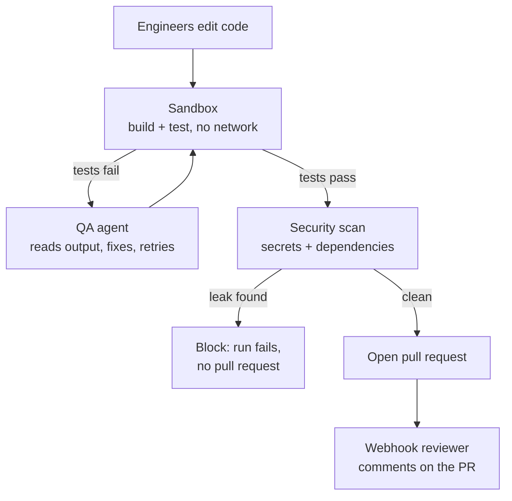

# Execution & QA

Phase 3 design note. Plain language; the task list lives in
[BACKLOG.md](../BACKLOG.md).

## The problem

Through Phase 2 the agents can plan, edit, review, and open a pull request — but
nothing *runs* the code they write, and nothing checks it for leaked secrets or
risky dependencies. A Reviewer reads the diff, but a human still has to trust
that the change compiles and its tests pass. Phase 3 closes that gap: run the
code safely, let a QA agent fix what it breaks, scan for secrets and vulnerable
dependencies, and let a reviewer comment on real pull requests.

## Workstreams

- **Sandbox execution** — run builds and tests inside a disposable Docker
  container with CPU / memory / time limits and **no network egress** (ADR-0008).
  This is the one place arbitrary code runs, so it is the most security-critical
  piece of the phase.
- **QA agent** — after the engineers finish, the QA agent runs the tests in the
  sandbox, reads the failure output, fixes the code, and retries a bounded number
  of times before giving up with a clear reason.
- **Security scanning** — before a pull request opens, scan the diff for secrets
  (API keys, private keys, tokens) and flag risky dependency changes. A found
  secret blocks the pull request outright.
- **Webhook reviewer** — a GitHub webhook drives the Reviewer agent against real
  pull requests (not just agent-authored ones), posting its findings as review
  comments within minutes.

## Exit criteria (from the roadmap)

1. Agent-modified code runs its tests in the sandbox before the pull request.
2. The review agent comments on a webhook'd pull request within 5 minutes.
3. The secrets scanner blocks a seeded leak.

## Order of work

Security scanning ships first: it is deterministic, runs offline, needs no Docker
or network, and delivers exit criterion 3 immediately — design note
[SECRETS_SCANNING.md](SECRETS_SCANNING.md). The Docker sandbox and the QA agent
follow (exit criterion 1), then the webhook reviewer (exit criterion 2).
