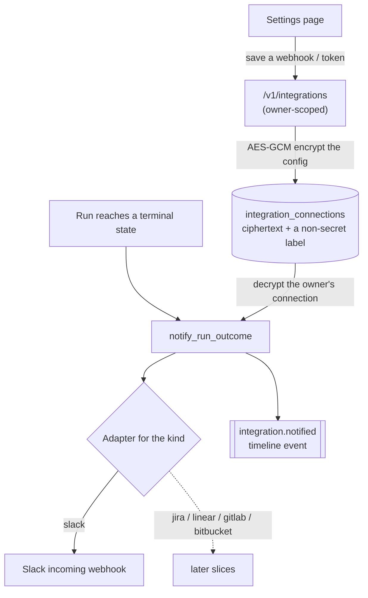

# External Integrations

Phase 6 workstream. Plain language; the task list lives in
[BACKLOG.md](../BACKLOG.md).

## The problem

The platform lives on its own island. A run finishes, a plan is written, work
items pile up — but a team's actual day happens somewhere else: in Slack, in a
Jira or Linear board, on a GitLab or Bitbucket repository. Nothing the platform
does today reaches those places, so a person has to go and look.

External integrations connect the platform outward: when something happens here,
tell the tools the team already uses. The first slice is the smallest useful
one — **post a run's outcome to Slack** — built on a foundation the other
integrations will reuse.

## The design

Three pieces, each reused by every future integration:

- **Connections store** — one row per (user, kind) in `integration_connections`.
  A connection's secret config (a Slack webhook URL; later, an API token) is
  encrypted at rest with the same AES-GCM helper as the provider keys
  (`engine/security/crypto.py`, [PROVIDER_KEYS.md](PROVIDER_KEYS.md)). Only the
  ciphertext and a **non-secret label** (e.g. `hooks.slack.com · ending 1a2b`)
  are stored; the secret is decrypted only when a message is about to be sent.
- **Adapter layer** (`engine/integrations/`) — one small module per external
  service. An adapter takes a decrypted config and does exactly one outward
  thing (Slack: post a message to the webhook). Adapters never touch the
  database or a run; they are pure "send this there" functions, easy to test.
- **Dry-run mode** — `INTEGRATIONS_DRY_RUN=1` makes every adapter skip the
  network and report success. Tests and offline dev set it (like `LLM_FAKE` for
  models and `SANDBOX_ENABLED=0` for Docker), so the whole path — configure →
  run finishes → notify → timeline event — runs with no real Slack workspace.

### How a run notifies

When a run reaches a terminal state, the runner already remembers it
(`capture_run_memory`, [KNOWLEDGE_AND_MEMORY.md](KNOWLEDGE_AND_MEMORY.md)).
`notify_run_outcome` runs in the same place, right after capture: it looks up
the run's owner, loads their enabled Slack connection (if any), formats a short
message — did the run succeed, and the pull-request link or the failure reason —
sends it through the adapter, and records an `integration.notified` timeline
event. Like capture, it **never breaks a run**: any failure is logged and
swallowed, and a run with no connection simply notifies nothing (no event).

## API

Owner-scoped, mirroring the provider-keys API:

- `GET /v1/integrations` — which integrations are connected (kind, label,
  enabled, when) — never the secret config.
- `PUT /v1/integrations/{kind}` — set or replace a connection's config;
  validates the kind is *active* and the config's shape (a Slack webhook must be
  a `https://hooks.slack.com/…` URL).
- `DELETE /v1/integrations/{kind}` — disconnect.
- `POST /v1/integrations/{kind}/test` — send a test message now, so the settings
  page can prove a webhook works (returns whether it sent, or was a dry run).

## Kinds

`IntegrationKind` names all the planned services — `slack`, `jira`, `linear`,
`gitlab`, `bitbucket` — so the model and enum are forward-looking, but the API
only accepts the **active** ones. This slice activates `slack`; a `PUT` to an
inactive kind is refused with "not yet supported" until its adapter lands.

## Exit criterion (this slice)

With a Slack webhook saved on the settings page, a run that reaches a terminal
state posts its outcome to Slack and records an `integration.notified` event on
the run timeline. In dry-run mode the same path runs end to end without a real
webhook, which is how it is tested.

## Boundaries (kept out of this slice)

- Only **outbound** Slack notifications. Jira/Linear issue push and
  GitLab/Bitbucket merge requests reuse this foundation in later slices.
- Connections are per **user**, not per organization (same call as the provider
  keys) — organization-shared connections can come with the organization
  switcher.
- No inbound webhooks from these services here (the GitHub PR-review webhook is
  separate, [WEBHOOK_REVIEWER.md](WEBHOOK_REVIEWER.md)).
- No retry queue: a failed notification is logged, not retried — the run's own
  record and memory are unaffected.
