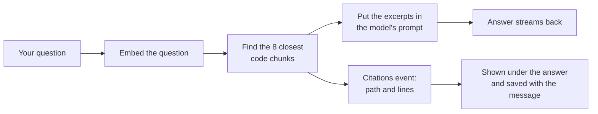

# Grounded chat — answers that cite the code

## The problem

The chat can talk about software in general, but it knows nothing about *your*
repository. Phase 2 built a code index (see
[REPOSITORY_INTELLIGENCE.md](REPOSITORY_INTELLIGENCE.md)); grounded chat is the
first feature that uses it: pick a connected repository, ask a question, and
the answer is built from real code excerpts — with citations saying exactly
which files and lines it came from.

## How a grounded answer happens

1. The chat request may carry a `repository_id` (the repository must belong to
   the signed-in user, same ownership rule as everywhere else).
2. The question is embedded and the closest chunks are fetched from
   `code_chunks` by cosine distance — the exact same retrieval the repository
   search page uses, now shared in `engine/indexing/retrieval.py`.
3. The excerpts go into a system message that tells the model: ground your
   answer in these, cite files as `path:start-end`, and say so when the
   excerpts don't contain the answer.
4. The SSE stream gains one event: `citations`, sent before the tokens, listing
   each source (`path`, `start_line`, `end_line`, `score`).
5. The citations are stored on the assistant message (`messages.citations`,
   migration `0005`), so reopening the conversation shows them again.

## What it looks like

The chat page gets a repository picker. With no repository selected, chat
behaves exactly as before. With one selected, every answer ends with a small
sources list: `app/main.py:1-42 · score 0.91`.

## Limits (deliberate, for now)

- Retrieval is embeddings-only; hybrid keyword + vector ranking is a separate
  backlog item ("Repository Intelligence — hybrid retrieval").
- The model sees at most 8 excerpts of ~60 lines; very broad questions may need
  the future dependency-graph views.
- Offline (`LLM_FAKE=1`) the reply text is canned, but retrieval, the
  citations event, and persistence all run for real — that is what the tests
  cover.
