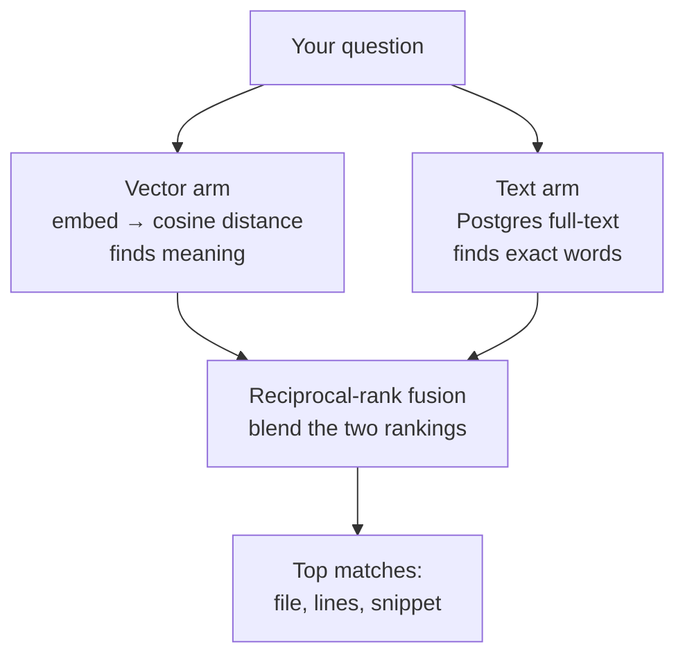

# Hybrid Retrieval

Phase 2 design note. Plain language; the task list lives in
[BACKLOG.md](../BACKLOG.md). Builds on
[REPOSITORY_INTELLIGENCE.md](REPOSITORY_INTELLIGENCE.md).

## The problem

Pure vector search finds code by *meaning*, which is great for "where is
authentication handled?" but it can miss an **exact word** — a function name,
an error string, a config key. Ask for `service_name` and a vector search
might rank three vaguely-related files above the file that literally contains
`service_name`. Plain keyword search has the opposite problem: it nails exact
words but is blind to meaning.

Hybrid retrieval runs **both** and blends the results, so a chunk that either
arm likes rises to the top.

## How it works

- **Vector arm** — the question is embedded and chunks are ordered by cosine
  distance (unchanged from version 1).
- **Text arm** — Postgres full-text search over a stored `content_tsv` column
  (`to_tsvector('english', content)`, a `GIN` index makes it fast). The
  question's words are turned into an OR query (`to_tsquery`), and matches are
  ranked by `ts_rank`. This arm needs no model, so it works offline.
- **Reciprocal-rank fusion (RRF)** — each arm produces a ranked list. A chunk's
  fused score is the sum over the arms of `1 / (k + rank)` (rank starting at 1,
  `k = 60`, the standard default). A chunk ranked #1 by one arm and unranked by
  the other still scores well; a chunk both arms like scores best. RRF blends
  *rankings*, not raw scores, so the two arms' different number scales never
  need to be reconciled.

Each returned chunk keeps its **cosine similarity** as the displayed `score`
(1.0 = identical meaning) — RRF only decides the order.

`retrieve_chunks` in `engine/indexing/retrieval.py` stays the single entry
point behind the search endpoint, grounded chat, and the agents' `search_code`
tool; they all gain hybrid ranking for free.

## Why RRF (and not weighted scores)

Cosine distance and `ts_rank` live on different scales, so adding them needs
tuning weights that drift per repository. RRF sidesteps that: it only looks at
each arm's rank order, which makes it robust and parameter-light — one constant
`k`, no per-repository tuning.

## Proving it helps: retrieval evaluation

The phase exit criterion is that hybrid retrieval scores at least as well as a
plain keyword (grep) baseline. `engine/retrieval_eval.py` holds a small golden
question set against the fixture service (`fixtures/demo-service`) — each
question with the file that should answer it. For every question it runs both
hybrid retrieval and the grep baseline and records whether the right file lands
in the top results (recall@k) and how high (mean reciprocal rank).
`scripts/eval_retrieval.py` prints the scorecard.

Offline (`LLM_FAKE=1`) the embeddings are deterministic but meaningless, so the
vector arm is noise and the numbers really measure the text arm plus the fusion
mechanics — the harness doubles as an offline smoke, exactly like the agent
evaluation. A real embedding model is what shows the semantic lift over grep;
the scorecard has a column for each method so the comparison is explicit.

## What this is not (yet)

No approximate-nearest-neighbor (hnsw) index — exact search is fine at this
size. No tree-sitter chunking, no incremental re-indexing — separate backlog
items in this phase.
