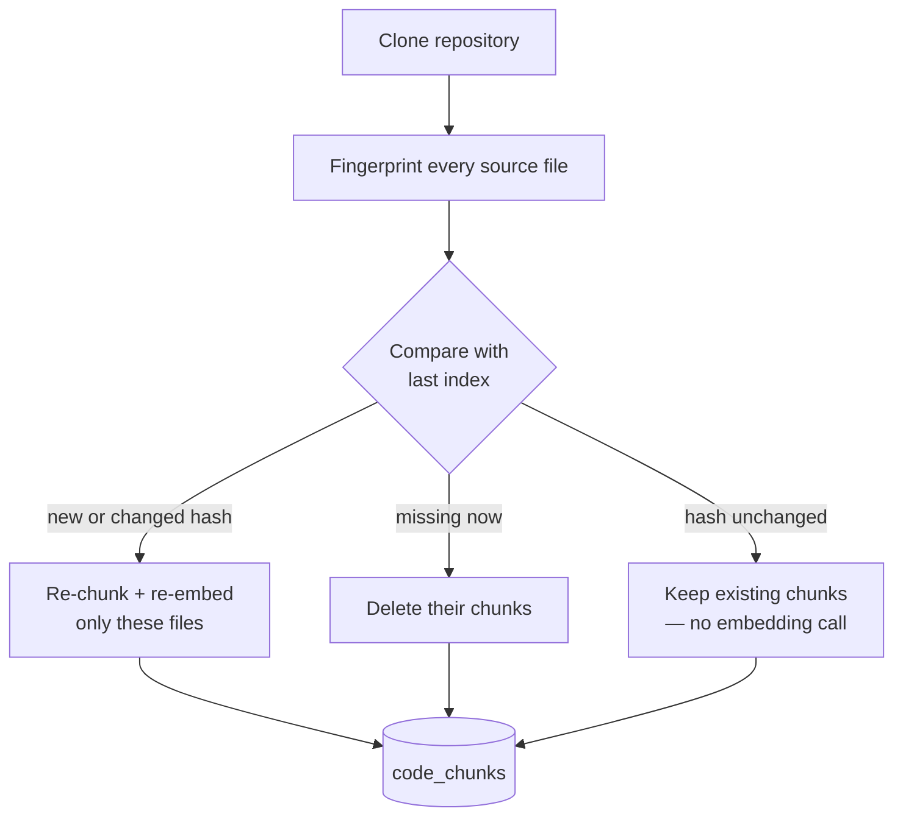

# Incremental & Scalable Indexing

Phase 2 design note. Plain language; the task list lives in
[BACKLOG.md](../BACKLOG.md). Builds on
[REPOSITORY_INTELLIGENCE.md](REPOSITORY_INTELLIGENCE.md).

## The problem

Re-indexing a repository used to throw away every chunk and re-embed the whole
tree, even when a single file changed. Embedding is the slow, paid step, so
re-indexing a large repository after a one-line edit wasted almost all of that
work. Two fixes:

1. **Incremental re-indexing** — only re-embed the files that actually changed.
2. **Approximate-nearest-neighbor (HNSW) index** — keep search fast as a
   repository grows past what an exact scan can answer quickly.

## Incremental re-indexing

Each indexed file remembers a fingerprint of its contents — a SHA-256 of the
bytes — in a small table, `indexed_files` (repository, path, content hash). On
the next index we clone the repository, fingerprint every source file again, and
compare:



- **Changed or new files** — their old chunks are deleted and the file is
  re-chunked and re-embedded from scratch.
- **Deleted files** — their chunks are removed.
- **Unchanged files** — left exactly as they are. No embedding call, and the
  existing rows (and their `created_at`) are preserved.

The first index of a repository has no stored fingerprints, so every file counts
as new — a full build, same as before. After that, a re-index only pays for what
moved.

**Dependency edges stay a full rebuild.** Extracting import edges is cheap
tree-sitter parsing with no paid embedding call, and edges cross files (file A's
import of file B lives on A's row), so recomputing the whole graph every index is
both simple and always correct. Only the expensive embedding step is made
incremental.

**Known limits.** Changing the embedding model does not invalidate old vectors —
force a fresh build by disconnecting and reconnecting the repository, or by
re-indexing after the fingerprints are cleared. A file that only changes its
modification time but not its bytes is correctly treated as unchanged.

## Approximate-nearest-neighbor index (HNSW)

Vector search orders chunks by cosine distance. On a small index Postgres just
scans every row, which is exact but linear in the number of chunks. pgvector's
**HNSW** index builds a navigable small-world graph over the embeddings so the
database can jump to the closest vectors without scanning all of them — search
stays fast as repositories grow to hundreds of thousands of chunks.

```sql
CREATE INDEX ix_code_chunks_embedding_hnsw
    ON code_chunks USING hnsw (embedding vector_cosine_ops);
```

- The operator class is `vector_cosine_ops` because retrieval ranks by cosine
  distance (`<=>`); the index only helps queries that order by the same operator.
- HNSW is *approximate*: it may miss a true nearest neighbor occasionally, traded
  for speed. Hybrid retrieval's full-text arm and reciprocal-rank fusion cushion
  any single miss, so the fused results stay stable.
- No code change in retrieval — the existing `ORDER BY embedding <=> query LIMIT`
  automatically uses the index once it exists. Our embeddings are 768 numbers,
  well under pgvector's 2000-dimension indexing limit.

## What did not change

The chunk record — (path, language, line range, text, embedding) — and every
retrieval path (search endpoint, grounded chat, the agents' `search_code` tool)
are untouched. A re-index simply does less work, and search stays fast on larger
repositories.
