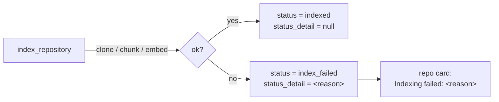

# Surfacing the Indexing-Failure Reason

**Status:** Design accepted · **Phase:** 8 follow-up · **Written:** 2026-07-23

## The problem

When a repository failed to index — a bad clone URL, a private repo with no
credentials, a network hiccup — the indexer set `status = "index_failed"` and
wrote the real reason only to the engine logs. The user saw a red "index failed"
badge with **no explanation** and no way to tell a fixable mistake (typo in the
URL) from a transient one (retry). A support pain, and an easy fix.

## The design

One nullable column, `repositories.status_detail` (migration 0023), carries a
short human reason:

- **Set on failure, cleared on success.** The indexer's `except` records
  `str(exc)[:500]` (capped, falling back to the exception type name); a
  successful index sets `status_detail = None`, and starting a re-index clears
  it too, so a stale reason never lingers after a fix.
- **Exposed on the existing shape.** `RepositoryOut` gains `status_detail`, so
  the repositories list already carries it — no new endpoint. The repo card
  shows `Indexing failed: <reason>` (truncated, full text on hover) only when
  the status is `index_failed`.
- **No behaviour change otherwise.** The reason is informational; the
  status-driven UI (the re-index button, the polling while `indexing`) is
  unchanged.

## Boundaries

- **A reason, not a diagnosis.** It's the raised error's message — enough to
  recognise "repository not found" or "authentication failed", not a structured
  error code. Good enough to act on; a taxonomy is a later refinement.
- **Not shown for healthy repos.** `status_detail` is null for connected and
  indexed repositories; it only appears on a failure.
