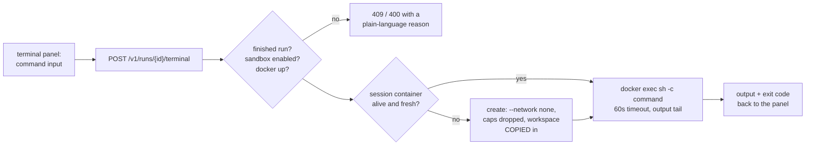

# In-Browser Terminal

**Status:** Design accepted · **Phase:** 6 — the last workspace panel
· **Written:** 2026-07-19

## Why

The run page can browse, edit, commit, and push a finished run's workspace —
but understanding a run often means *running* something: the tests, a REPL
one-liner, `ls -la` in a directory the file tree renders awkwardly. Leaving
the platform to do that breaks the loop the workspace panels exist for.

ADR-0008 draws a hard line: agent-adjacent code executes **only** inside the
Docker sandbox. The terminal does not move that line — it goes through it.
Every command runs in the same hardened container the QA gate uses.

## The shape: a command console, not a PTY

One command in, its output back. No PTY, no WebSocket, no interactive
processes — the same request/response + polling shape as every other panel.
An honest 90% of the need (run the tests, inspect files, try a script) at a
fraction of the attack surface.

## The session container

- **Created lazily** on the first command, per run: the sandbox's hardening
  flags (`--cap-drop ALL`, `--security-opt no-new-privileges`, memory/CPU/
  pids limits) plus one stricter choice — **`--network none` from birth**.
  The terminal has no install phase and no egress, ever. Installing
  dependencies is the pipeline sandbox's job.
- **The workspace is copied in, never mounted** — the terminal is a
  *scratch copy*. Edits made inside it do not reach the real workspace (the
  editor + commit panel is the write path). The panel says so.
- **State persists between commands** (`cd` does not, but created files and
  variables via files do) until the session ends: an explicit Reset, a
  session older than 30 minutes (checked lazily before each command — no
  background reaper), or the container dying. The next command starts a
  fresh copy and says `(fresh session)`.
- **Labeled** `asep.terminal=1` like the sandbox's `asep.sandbox=1`, so
  orphans are findable and removable with one docker command.

## Guardrails

- Finished runs only (`completed`/`failed`) — the same 409 as the other
  write panels; an in-flight run's workspace belongs to the agent loop.
- 60-second command timeout; output tail capped like sandbox output;
  command length capped.
- `SANDBOX_ENABLED=0` or no Docker daemon → a plain-language refusal, never
  a silent hang (and never host execution).
- The same visibility scoping as the rest of the run page — org members
  share the terminal like they share the run.

## Exit criterion

On a finished run with Docker up: `ls` shows the workspace's files, a
created file persists to the next command, Reset discards it, and a command
that tries the network fails (no egress). An in-flight run and a
sandbox-disabled engine both refuse with readable reasons.

## Boundaries

- **No PTY/streaming** — long commands block until done or the 60s timeout;
  `vim`, `top`, and interactive prompts are out of scope by design.
- **No writes back to the workspace** — scratch copy only.
- **No dependency installs** — no network, no exceptions; the message
  points at the pipeline sandbox.
- In-cluster (pods without a Docker daemon) the terminal refuses exactly
  like the QA sandbox does — the chart's `SANDBOX_ENABLED=0` note applies.
