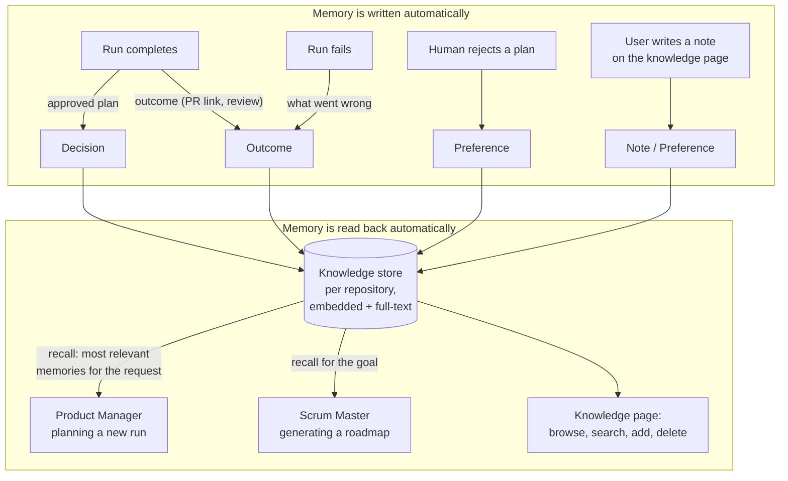

# Knowledge & Memory

Phase 5 design note. Plain language; the task list lives in
[BACKLOG.md](../BACKLOG.md).

## The problem

Every run the platform executes today is an island. The team plans, codes,
reviews, and opens a pull request — and then forgets everything. The next run
starts from zero: it does not know that the human rejected a similar plan last
week, that the reviewer keeps flagging the same kind of mistake, or that a
past run already implemented half of what is being asked. A real engineering
team remembers; ours has amnesia.

Phase 5 gives the platform a **long-term memory**: a durable, searchable store
of what happened and what the team prefers, written automatically as runs
finish and read back automatically when new work is planned.

## What a memory is

One **knowledge item**, scoped to a repository (like work items are). Four
kinds, stored as plain strings so adding a kind never needs a migration:

| Kind | What it records | Written by |
|---|---|---|
| `decision` | an approved plan — what the team agreed to build and how | the runner, when a run completes |
| `outcome` | how a run ended — pull request opened, or why it failed | the runner, at either terminal state |
| `preference` | how the team likes things done — including rejected plans | the human (page or rejection gate) |
| `note` | anything worth remembering (meeting notes live here) | the human, on the knowledge page |

Each item carries a title, the content, an embedding (the same
`ModelRouter.embed()` route the code index uses), a generated `content_tsv`
column, and an optional link to the run that produced it. That run link is the
first edge of the knowledge graph: memory ↔ run ↔ pull request, all already
connected through existing tables.

## Recall — memory feeding agent context

Recall is the Phase 2 hybrid retrieval pattern applied to memories instead of
code chunks: a vector arm (meaning) plus a full-text arm (exact words), fused
with reciprocal-rank fusion. `engine/knowledge/recall.py` mirrors
`engine/indexing/retrieval.py` deliberately — same shape, same constants —
so anyone who understood one understands the other.

Two agents read memory before they plan:

- **Product Manager** — when a new run starts, the runner recalls the memories
  most relevant to the feature request and injects them into the planning
  prompt as a "Team memory" block. A `memory.recalled` event lands on the run
  timeline so the recall is visible and testable.
- **Scrum Master** — roadmap generation recalls memories relevant to the goal
  and hands them to the model next to the repository file context.

Agents are told memory is *context, not command* — a past decision informs the
plan; the current request always wins.

## Workstreams

- **Knowledge store** *(blocking)* — the `knowledge_items` table (embedding +
  full-text columns, migration), the write path (`remember`), and the recall
  path (hybrid retrieval). Nothing can be remembered without a place to keep it.
- **Automatic capture** *(blocking)* — the runner writes a `decision` and an
  `outcome` when a run reaches a terminal state; rejecting a plan at the
  approval gate records a `preference`. Capture must never break a run — a
  memory write failure is logged, not raised.
- **Memory feeding agent context** *(blocking)* — recall injected into Product
  Manager planning (with the `memory.recalled` timeline event) and Scrum Master
  roadmap generation. This is the headline capability.
- **Knowledge API & page** *(planned)* — list / add / delete / search under
  `/v1/repositories/{id}/knowledge`, and a knowledge page in the web app with
  kind badges, source-run links, a search box, and an add-a-note form.
- **Grounded chat reads memory** *(stretch)* — repository chat blends recalled
  memories into its context next to code citations.

## Exit criteria

1. A finished run leaves durable memory behind: the approved plan is saved as a
   `decision` and the result (pull request or failure reason) as an `outcome`,
   both searchable on the knowledge page after the run itself is long gone.
2. Memory feeds agent context: planning a new run recalls the most relevant
   memories and injects them into the planner's prompt — a stored preference
   demonstrably reaches the next run's planning context (the `memory.recalled`
   event proves it on the timeline).

## Order of work

The **knowledge store comes first** — capture and recall both need it. Then
**automatic capture** (exit criterion 1), then **recall into planning** (exit
criterion 2), then the **API and page** that make memory visible. Each step
reuses what the one before it built.

## Boundaries (kept out of Phase 5)

- No separate graph database — the "graph" is knowledge items linked to runs
  (and through them to pull requests) inside Postgres. A visual graph explorer
  can come later; the edges exist today.
- No cross-repository or organization-wide memory yet — memory is scoped to a
  repository, like the code index and the backlog.
- No automatic summarization/compaction of old memories — volumes are tiny at
  this stage; revisit when a repository accumulates thousands of items.
- Meeting notes are hand-entered `note` items — there is no calendar or
  transcript integration (that is Phase 6, Workspace & Integrations).
