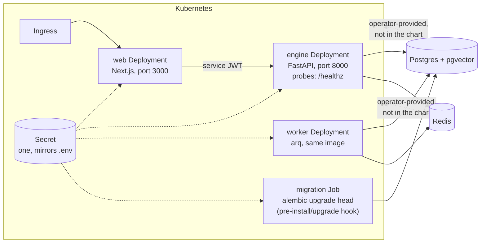

# Kubernetes Deploy

Phase 7 design note — production container images and a Helm chart, the
"deploys somewhere sturdier than one dev machine" workstream from
[PRODUCTION_HARDENING.md](PRODUCTION_HARDENING.md).

## The problem

Everything so far runs from a dev checkout: `pnpm dev`, a compose file for the
data stores, no production images at all. An operator has nothing to install.
This slice ships the two images and one Helm chart that turn the platform into
something `helm install` can put on any Kubernetes cluster.

## Shape

## Decisions

- **Two images, three workloads.** `infra/docker/engine.Dockerfile` builds one
  engine image that runs as the API (`uvicorn`), the worker (`arq`), and the
  migration Job (`alembic upgrade head`) — same code, different command.
  `infra/docker/web.Dockerfile` builds the Next.js app with
  `output: "standalone"`, so the runtime image carries only the built server,
  not the monorepo. Both run as a non-root user.
- **The engine stays private.** Only the web Service can get an Ingress; the
  engine Service is ClusterIP and is reached exclusively by the BFF with its
  signed service JWT — the same boundary ADR-0002 drew, now enforced by
  cluster networking.
- **One Secret mirrors `.env`.** The chart renders a single Secret from
  `values.yaml` (or points at an operator-managed `existingSecret`), and every
  workload consumes it with `envFrom`. Same names as `.env.example`, no
  translation layer to keep in sync.
- **Migrations run as a Helm hook.** A `pre-install,pre-upgrade` Job runs
  `alembic upgrade head` before new pods roll, so code never starts against an
  older schema. better-auth's tables are the web app's own
  (`pnpm --filter web auth:migrate`) and are documented as the operator's
  first-install step, exactly as in dev.
- **Data stores are the operator's.** Postgres, Redis, and MinIO/S3 are *not*
  subcharts — a serious install uses managed services or dedicated operators,
  and a toy install can port-forward to compose. The chart takes their URLs as
  values. Two Postgres requirements carry over from dev, documented in the
  chart: the engine role must be **NOSUPERUSER** (superusers bypass row-level
  security) and the **pgvector** extension must be available to that role
  (dev solves this by installing it into `template1`).
- **Probes and limits.** Engine liveness + readiness hit `/healthz` (public by
  design, excluded from traces and rate limiting). Web probes `GET /`. Every
  workload ships default resource requests/limits — deliberately modest
  placeholders until the benchmarks workstream measures real hot paths.

## Exit criterion (this slice)

`docker build` produces both images; the engine image answers `/healthz`
locally. `helm lint` passes and `helm template` renders valid manifests —
checked in CI on every push, so the chart cannot rot silently.

## Boundaries (kept out of this slice)

- **The sandbox is off in-cluster** (`SANDBOX_ENABLED=0` in chart defaults).
  The QA sandbox shells out to a Docker daemon, which pods don't have; giving
  them one safely (DinD, Kata, or a remote builder) is its own follow-up.
- **Engine network isolation is available, mTLS is not yet.**
  `engine.networkPolicy.enabled=true` renders a NetworkPolicy that allows
  ingress to the engine only from the web pods — the network-isolation half of
  the BFF→engine trust story (ADR-0002). It is off by default: enforcement needs
  a CNI that implements NetworkPolicy, and the cluster must allow kubelet health
  probes to reach the engine pods (node-sourced, exempt by default on most
  CNIs — verify on yours). Mutual TLS is the stronger, separate follow-up and
  needs cert-manager. No autoscaling yet either.
- **No telemetry stack.** The engine exports OTLP when pointed at a collector
  (`OTEL_EXPORTER_OTLP_ENDPOINT`); running one is the operator's side of the
  contract, as the observability slice already established.
- **Backups need a durable home.** `BACKUP_ENABLED=1` on the worker writes
  nightly dumps to `BACKUP_DIR`. Two ways to make that survive a pod restart,
  both shipped: set `worker.backup.persistence.enabled=true` to have the chart
  create a `ReadWriteOnce` PVC, mount it, and point `BACKUP_DIR` at it (off by
  default, pairs with a single worker replica); or ship dumps off-host with
  `BACKUP_S3_BUCKET` (BACKUPS_AND_RECOVERY.md). The S3 path survives a lost
  node too, so it is the stronger default.
- **No registry/publish pipeline** — images build locally or in CI; pushing
  them somewhere is part of the operator rollout.
