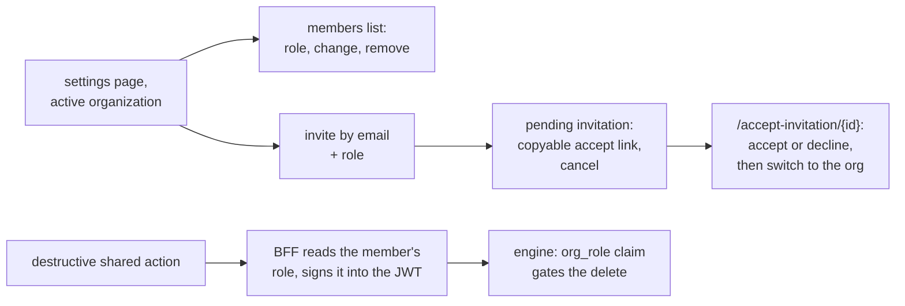

# Organization Members, Invitations, and Roles

**Status:** Design accepted · **Phase:** follow-up to organization sharing
· **Written:** 2026-07-19

## Why

Organizations shipped as a switcher plus sharing — but an organization with
no way to add a second member is a label, not a team. And once teammates
exist, "members are equal collaborators" needs one refinement: *destroying*
a shared resource should take more than membership.

better-auth's organization plugin already carries the whole machinery —
members with roles (`owner` / `admin` / `member`), invitations with an
accept/reject flow — the platform just never surfaced it.

## The pieces

- **Members panel** (settings, when an organization is active): every member
  with their role; admins and the owner can change roles and remove
  members (better-auth enforces its own rules server-side — e.g. only the
  owner touches owner).
- **Invitations**: invite by email with a role (`member` or `admin`).
  There is no email provider wired, so the pending invitation shows a
  **copyable accept link** — send it over whatever channel the team uses.
  The invitee signs in with that email and accepts (or declines) at
  `/accept-invitation/{id}`; accepting switches them into the organization.
- **The role reaches the engine only where it matters.** The service JWT
  stays lean: the two destructive routes (repository disconnect, shared
  provider-key removal) have their BFF handlers look up the caller's role
  (`auth.api.getActiveMember`) and sign it into the token as `org_role`;
  the engine's `Principal` parses it.

## The rule the role enforces

> Members create and work; destroying a shared thing you did not create
> takes an admin.

- **Repository disconnect**: an org-shared repository can be disconnected
  by its connector or an admin/owner — a plain member cannot disconnect a
  teammate's repository (their *own* stays theirs to disconnect).
- **Shared provider key removal**: by its contributor or an admin/owner.
- Everything else is unchanged — members still see, use, replace, approve,
  and push like before (ORGANIZATION_SHARING.md's "equal collaborators"
  holds for *work*; the refinement is only about destruction).

## Honest boundaries

- **No viewer role.** better-auth's defaults are owner/admin/member; a
  read-only role needs custom access control and a real need first.
- **Replace-not-delete is open by design**: a member can still replace the
  team's provider key (that is work, not destruction). The gate is
  hygiene against accidents, not a hard wall against a hostile member.
- **No invitation emails** — the copyable link stands in until an email
  provider exists.
- Role changes and member removal are better-auth's own endpoints with its
  own permission rules; the platform adds UI, not policy, there.
