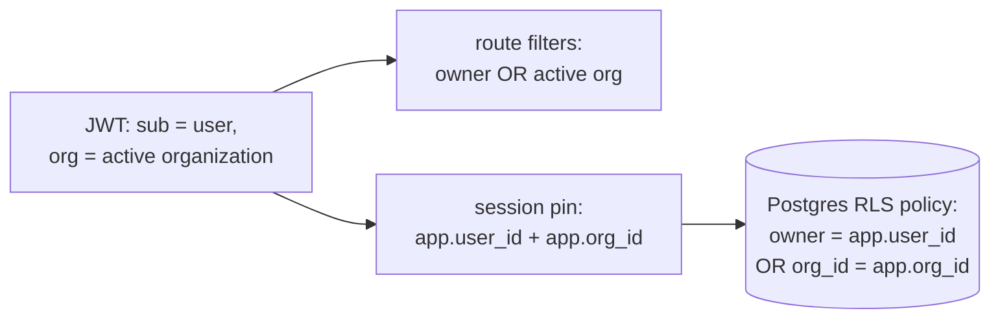

# Organization-Aware Sharing

**Status:** Design accepted · **Phase:** 7 follow-up (unblocked by the
organization switcher) · **Written:** 2026-07-16

## Why

Until now every resource had exactly one owner: your repositories, your runs,
your keys. A team platform where teammates cannot see the team's agent runs
is not a team platform. The organization switcher
([SIGN_IN_AND_ORGANIZATIONS.md](SIGN_IN_AND_ORGANIZATIONS.md)) shipped the
missing prerequisite: the active organization now rides in every service JWT
as the `org` claim, and the engine's `Principal` already parses it. This
slice makes the claim mean something.

## The model: the active organization shares

A resource created while an organization is active carries that
organization's id (`org_id` — the columns and creation-time stamping have
existed since the foundation schema). From this slice on:

> A row is visible when **you own it**, or when **its `org_id` matches your
> active organization**.

Both layers say the same thing: the route filters give friendly 404s and
correct lists; the RLS policies make Postgres itself enforce it even when a
query forgets its WHERE clause — the same defense-in-depth split
[ROW_LEVEL_SECURITY.md](ROW_LEVEL_SECURITY.md) established.

## What is shared, what stays personal

| Resource | Sharing | Why |
|---|---|---|
| Repositories (and everything under them: documents, knowledge, work items, search, graph) | **shared** with the active organization | connecting a repo under an org means the team works on it |
| Agent runs (timeline, tasks, diff, files, approval) | **shared** with the active organization | the team watches — and can approve — the team's runs |
| Conversations (chat) | personal | a chat with the assistant is a private notebook; `org_id` is recorded for the future but grants nothing |
| Provider keys | personal by default; **explicitly shareable** *(since 2026-07-19)* | a secret is never shared automatically — the owner opts in per key, and a personal key always outranks the team's (PROVIDER_KEYS.md) |
| Integrations | personal | secrets stay with the person who pasted them |

## Trust: where the membership check lives

The engine never reads better-auth's `member` table. It doesn't need to:
better-auth's `organization.setActive` refuses an organization the user is
not a member of, so `activeOrganizationId` — the value the BFF signs into
the `org` claim — is already membership-checked. The engine trusts `org`
exactly the way it trusts `sub`: because the BFF signed it (ADR-0002).

## How it lands

- `engine/auth.py` — `peek_principal()` returns the whole verified principal
  (subject + org), replacing the subject-only peek.
- `engine/db/session.py` — the session pin carries both ids; the
  `after_begin` hook sets `app.org_id` alongside `app.user_id`.
- `engine/db/rls.py` — stays the single source of truth. Tables in
  `ORG_SHARED_TABLES` (`repositories`, `agent_runs`) get the
  `OR org_id = app.org_id` clause in USING and WITH CHECK; the other three
  keep owner-only policies. A new Alembic migration freezes the updated
  policies; the test suite keeps applying the living version.
- `engine/db/visibility.py` — one helper for both enforcement shapes:
  `visible_clause()` for list queries, `can_access()` for point lookups.
  Every route that checked `owner != principal.user_id` on a repository or a
  run now asks the helper.

## Exit criterion

Two users, one organization. Alice connects a repository and starts a run
with the organization active. Bob — pinned session, organization active,
raw SQL with no WHERE — sees the repository and the run; with a different
(or no) active organization he sees neither. Bob still cannot see Alice's
conversations or provider keys under any organization. And the full
existing suite stays green: personal resources behave exactly as before.

## Honest boundaries

- **Members are equal collaborators for creating and working.** Any member
  of the active organization can read *and write* shared rows — approve a
  run, edit a plan. One refinement landed later: *destroying* a shared thing
  you did not create (disconnecting a teammate's repository, removing the
  team's provider key) takes an organization admin — see
  [ORGANIZATION_ROLES.md](ORGANIZATION_ROLES.md).
- **Sharing follows the *active* organization, not all memberships.** A row
  shared with org A is invisible while org B is active — switch to see it.
  One GUC, one clause; all-memberships visibility would need engine-side
  membership reads and a subquery policy.
- **Existing rows keep their `org_id`** — resources created before this
  slice under an active organization were already stamped and become shared
  retroactively. That is the intended meaning of having created them under
  the organization.
- **Run execution is unchanged.** The runner works in the trusted unset
  context, and BYO key resolution still follows the run's owning user.
