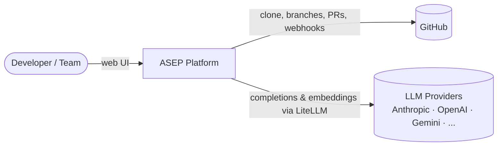
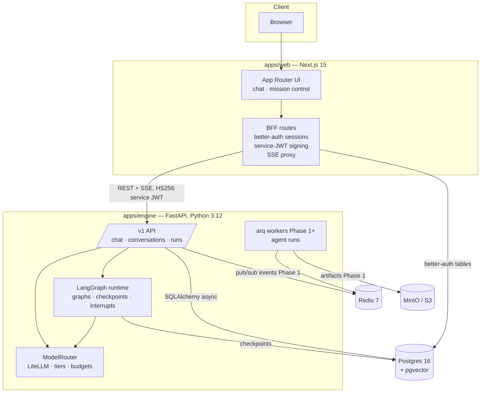

# Architecture Overview

**Status:** Living document · **Last updated:** 2026-07-02
Decisions with trade-offs are recorded as [ADRs](adr/); this document shows how the
pieces fit together.

## System context



## Containers



## Key flows

### Chat (Phase 0 walking skeleton)

1. Browser POSTs `{conversationId?, message}` to the BFF route `/api/chat`.
2. BFF validates the better-auth session, signs a short-lived HS256 **service JWT**
   (`sub` = user id) with `ENGINE_SERVICE_SECRET`, and forwards to engine `POST /v1/chat`.
3. Engine persists the user message, loads history from `messages`, runs the minimal
   LangGraph chat graph; the node streams tokens from `ModelRouter.stream()` (LiteLLM).
4. Tokens flow back as SSE (`event: token`), finishing with `event: done`. The BFF pipes
   the stream through untouched; the engine persists the assistant message.

### Agent run (Phase 1 target shape)

Feature request → PM agent drafts spec + task DAG → **LangGraph interrupt** for human
approval → Supervisor dispatches Backend/Frontend/DevOps agents against a per-run git
worktree under `.workspaces/<run>` (path-jailed tools) → Reviewer critiques the diff
(≤ 1 revision loop) → branch pushed, PR opened → events streamed live via Redis pub/sub
→ SSE; every step checkpointed in Postgres and auditable.

## Identity model

**better-auth owns identity.** Its CLI migration creates and manages `user`, `session`,
`account`, `verification`, `organization`, `member`, `invitation` tables in the same
Postgres database. The engine never writes those tables; engine-owned tables
(`conversations`, `repositories`, …) reference better-auth ids as plain `text` columns
without foreign keys, keeping the two schema owners decoupled (ADR-0007).

The engine trusts the BFF: requests carry a short-lived service JWT naming the acting
user/org. The engine is never exposed publicly in dev; in production it sits on a
private network behind the BFF (ADR-0002).

## Data ownership

| Tables | Owner / migration tool |
|---|---|
| user, session, account, organization, member, … | better-auth CLI (`auth:migrate`) |
| repositories, conversations, messages, audit_logs | engine / Alembic |
| LangGraph checkpoint tables | LangGraph `checkpointer.setup()` |

## Streaming architecture

- **Token streaming:** engine SSE → BFF pass-through → browser `fetch` + ReadableStream
  parser. SSE over WebSockets because flows are strictly server→client (ADR-0004).
- **Agent events (Phase 1):** workers publish to Redis pub/sub; an engine SSE endpoint fans
  out per-run event streams to mission control.

## Environments

| | Dev (now) | Production (Phase 7) |
|---|---|---|
| Services | Docker Compose (`infra/docker`) | Kubernetes + Helm |
| Web/Engine | `pnpm dev` on host | Container images |
| Secrets | root `.env` | Secret manager / K8s secrets |
| Observability | structlog JSON to stdout | OTel → collector; Langfuse for LLM traces |

## Directory map

```
apps/web/src/app            # routes (App Router) + BFF endpoints under app/api
apps/web/src/lib            # auth config, service-token signing, env
apps/engine/src/engine/api  # FastAPI routers (health, chat, conversations)
apps/engine/src/engine/llm  # ModelRouter over LiteLLM
apps/engine/src/engine/agents  # LangGraph graphs (chat now, team in Phase 1)
apps/engine/src/engine/db   # SQLAlchemy models + session
apps/engine/src/engine/migrations  # Alembic
packages/shared             # generated OpenAPI types for the engine API
infra/docker                # compose file for dev services
```
