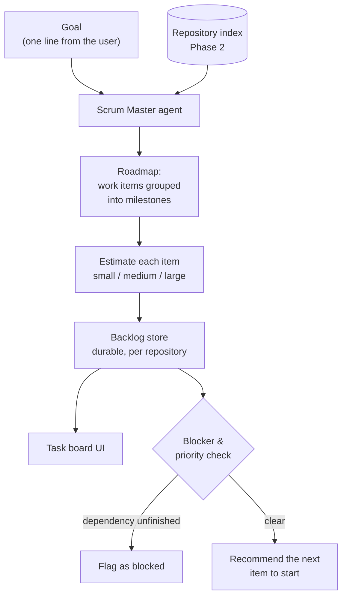

# Planning Suite

Phase 4 design note. Plain language; the task list lives in
[BACKLOG.md](../BACKLOG.md).

## The problem

Through Phase 3 the platform can take **one** feature request and drive it all
the way to a reviewed pull request. But real projects are not one request — they
are a stream of features, bugs, and chores that somebody has to organize: break a
big goal into a roadmap, estimate the pieces, decide what to do first, and notice
when one piece is stuck waiting on another. Today a person does all of that by
hand (this very roadmap and backlog are hand-written).

Phase 4 gives the platform a **planning brain**: a Scrum Master agent and the
tools around it that turn a one-line goal into an organized, estimated,
dependency-aware backlog, keep it current, and surface what is blocked and what
to do next.

## What is new here (and what already exists)

The agent runtime already has an `AgentTask` — but that is **ephemeral**: it lives
inside a single run and disappears from active use once the run finishes. Planning
work is different. A **work item** is **durable** and belongs to a *repository*,
not a run. It is written once during planning and lives on: estimated, reordered,
blocked, and eventually picked up by a coding run that implements it.

So Phase 4 introduces a new domain object — the **work item** — separate from the
per-run task. When a coding run finally implements a work item, the item simply
records which run did it; the two models stay distinct.

## Workstreams

- **Planning domain & backlog store** *(blocking)* — a `work_items` table
  (repository-scoped: title, description, kind, status, estimate, priority,
  dependencies, optional link to the run that implemented it), a CRUD API under
  `/v1/repositories/{id}/work-items`, and a task-board screen. Nothing can be
  planned until there is a place to keep the plan.
- **Roadmap generation** *(blocking)* — the Scrum Master agent takes a one-line
  goal plus repository context (from the Phase 2 index) and produces a set of
  work items grouped into milestones, with dependencies between them, saved to the
  backlog. This is the headline capability.
- **Estimation** *(planned)* — the agent gives each work item a relative estimate
  (small / medium / large — the same words the project already uses) with a
  one-sentence rationale, never a false-precision hour count.
- **Blocker detection & priority recommendations** *(planned)* — read the work
  items' dependencies and statuses to flag anything waiting on an unfinished
  dependency, and recommend the next unblocked, highest-value item to start.
- **Scrum Master agent role** *(blocking)* — a new agent role that ties the above
  together, following the same registry pattern (role → prompt → tool policy →
  model tier) as the existing agents.

## Exit criteria

1. From a one-line goal, the Scrum Master generates a milestone roadmap of
   estimated, dependency-linked work items, saved to the backlog and shown on the
   task board.
2. Blocker detection flags a work item whose dependency is unfinished, and the
   priority recommendation surfaces the next unblocked, highest-value item.

## Order of work

The **backlog store comes first** — there is nothing to plan, estimate, or
prioritize without a durable place to keep work items, and the task board makes
the whole phase visible early. **Roadmap generation** follows (exit criterion 1),
then **estimation**, then **blocker detection and priority recommendations**
(exit criterion 2). Each step reuses what the one before it built.

## Boundaries (kept out of Phase 4)

- No hour/day estimates or burndown math — relative sizes only.
- No new scheduling engine; ordering is by priority and dependencies, not calendar dates.
- Planning proposes work; a human still approves before any coding run starts
  (the Phase 1 approval gate is unchanged).
