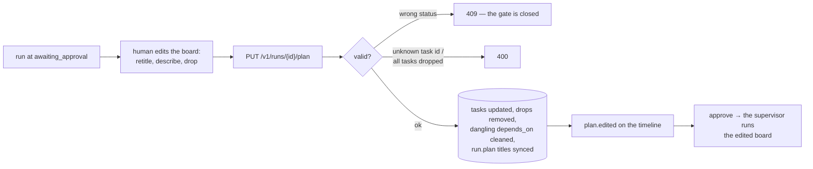

# In-Place Plan Editing

**Status:** Design accepted · **Phase:** Mission-Control leftover ("in-place
plan editing still pending") · **Written:** 2026-07-18

## Why

The approval gate was binary: approve the plan exactly as written, or
reject and start over. A plan that is *nearly* right — one task mis-titled,
one task unnecessary — forced a full reject-and-replan round trip, spending
tokens to fix what the human could have fixed in ten seconds.

## How

- **Only while `awaiting_approval`.** Before that there is no plan; after
  that the plan is running — the same `409` shape as every closed gate.
- **Edit and drop, not add.** The human retitles and re-describes tasks,
  and drops the unnecessary ones (at least one must remain — dropping
  everything means the plan is wrong, which is what Reject is for). Adding
  work by hand is out: mid-run the agents themselves add discovered tasks
  (TASK_BOARD_TOOLS.md), and a missing-from-the-start task means the plan
  deserves rejection.
- **Drops clean their edges.** A dropped task's id disappears from every
  remaining task's `depends_on`, so the board can never deadlock on a
  ghost. Sequence numbers keep their gaps — ordering is unchanged.
- **The plan record follows.** `run.plan["tasks"]` (the title list shown in
  the header) is rewritten from the surviving tasks, and `plan.edited`
  lands on the timeline with what changed — the audit trail shows the
  human's hand.

## Exit criterion

On a run awaiting approval, retitle one task and drop another; the board
shows the edit, the timeline shows `plan.edited`, and approving executes
exactly the edited board (the dropped task never runs). Editing any other
status is refused.

## Boundaries

- No role changes and no reordering — retitle/describe/drop covers the
  observed need; the rest is Reject territory.
- No concurrent-edit protection: last save wins, like the document editor.
- The Product Manager is not re-consulted about the edits — the human
  outranks the plan.
