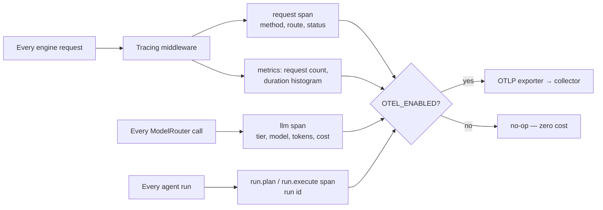

# Production Hardening

Phase 7 design note — the phase plan, plus detail on the first slice. Plain
language; the task list lives in [BACKLOG.md](../BACKLOG.md).

## The problem

Phases 0–6 built what the platform *does*. Phase 7 makes it something you could
*run for other people*: you can see it misbehaving before users tell you
(observability), it survives a bad day (backups, restore), it holds its
boundaries under pressure (rate limiting, RBAC depth, security audit), and it
deploys somewhere sturdier than one dev machine (K8s + Helm).

## Workstreams

- **Observability** *(first — everything else leans on it)* — wire the
  OpenTelemetry SDK the way ADR-0010 planned: traces for every request, LLM call,
  and agent run; metrics (request counts/latency, token spend); export via OTLP
  to whatever collector the operator runs. Alerting rules come once metrics flow.
- **Hardening the seams** — rate limiting on the engine API (debt register), and
  revisiting the BFF→engine trust (mutual TLS or network policy, ADR-0002 debt).
- **Backups & disaster recovery** — scheduled Postgres dumps, a tested restore
  path, and a written recovery runbook. A backup that has never been restored is
  a hope, not a backup.
- **RBAC depth & row-level security** — organization-aware authorization beyond
  owner-scoping, enforced in Postgres (RLS) as well as the API.
- **Deploy** — K8s manifests + a Helm chart; liveness/readiness wired to
  `/healthz`; resource limits informed by the benchmarks. Design note:
  [KUBERNETES_DEPLOY.md](KUBERNETES_DEPLOY.md).
- **Benchmarks & security audit** — performance baselines for the hot paths
  (indexing, retrieval, run pipeline) and a checklist audit of the security
  boundaries (jail, secrets, webhooks, JWTs).

## First slice: OpenTelemetry traces + metrics

The design follows OpenTelemetry's own split between API and SDK:

- **Instrument unconditionally with the API.** The middleware, the ModelRouter,
  and the runner always create spans through `opentelemetry-api`. With no SDK
  configured those calls are no-ops — near-zero cost — so the instrumented code
  has no `if telemetry:` branches and never needs to know whether an operator
  is watching.
- **Configure the SDK only when asked.** `OTEL_ENABLED=1` makes startup build
  the real tracer/meter providers; `OTEL_EXPORTER_OTLP_ENDPOINT` points them at
  a collector (OTLP over HTTP). Neither set — the default, and every test —
  costs nothing. Tests inject in-memory exporters through the same
  `configure_telemetry()` seam, so the assertions read real spans offline.
- **What gets traced:** one server span per request named by its route template
  (`POST /v1/chat`), with method/route/status attributes — `/healthz` is
  excluded so probes don't drown the trace stream; one span per LLM call
  (`llm.complete`, `llm.tools`, `llm.stream`, `llm.embed`) carrying tier, model,
  token counts, and cost — fake mode included, so traces exist offline too; one
  span per run phase (`run.plan`, `run.execute`) carrying the run id, tying a
  whole agent run together for post-mortems (the need ADR-0010 named).
- **What gets measured:** a request counter and a duration histogram, labelled
  by route and status code — the minimum an alert ("error rate", "p95 latency")
  needs.

## Exit criterion (this slice)

With telemetry enabled, one chat request produces a request span (route +
status) and an LLM span (tier, model) visible to the exporter, and the request
counter increments — proven offline by in-memory exporters in the test suite.
With telemetry disabled (the default), behavior and tests are unchanged.

## Boundaries (kept out of this slice)

- No collector/Prometheus/Grafana in compose — the engine *exports*; running a
  telemetry stack is the operator's side of the contract (and arrives with the
  Deploy workstream).
- No alerting rules yet — they need real traffic to calibrate against.
- No web-app telemetry — the engine is where the expensive, failure-prone work
  lives; the BFF proxies.
- Langfuse (ADR-0010's LLM-trace sink) stays deferred; OTLP is the neutral
  export path and a Langfuse exporter can ride it later.
