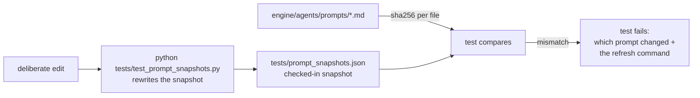

# Prompt Snapshots

**Status:** Design accepted · **Phase:** 1 leftover — Specialist Agents
workstream · **Written:** 2026-07-16

## Why

The nine agent prompts in `engine/agents/prompts/` are runtime assets, not
code: the registry reads them from disk and hands them to the model. That
means a prompt edit changes agent behavior with **zero** test signal — no
type error, no failing assertion, nothing. A stray edit (or a merge gone
wrong) ships silently.

The registry test already checks shape (every role has a substantial prompt
starting with "You are"). What is missing is drift detection: the suite
should fail when a prompt's *content* changes, so every change is deliberate
and reviewed.

## How

- `tests/prompt_snapshots.json` records every prompt file's SHA-256 and
  line count — small, diff-friendly, checked in.
- `tests/test_prompt_snapshots.py` recomputes and compares. Three ways to
  fail: a prompt changed, a prompt file appeared without a snapshot, a
  snapshot lost its file. Each failure message names the file and the
  refresh command.
- The same test module is the refresher: running it as a script
  (`uv run python tests/test_prompt_snapshots.py`) rewrites the snapshot
  from what is on disk. One file owns the format; the two can never drift.

## The intended workflow

1. Edit a prompt deliberately.
2. The suite fails, naming the prompt.
3. Review the diff (git already shows the wording change).
4. Refresh the snapshot; commit both files together.

The snapshot's job is step 2 — turning a silent behavior change into a
visible decision. Git's job is step 3; the snapshot never duplicates the
prompt text.

## Honest boundaries

- **This is drift detection, not quality evaluation.** A hash proves the
  prompt changed, not that it got worse. Judging prompt quality against the
  golden tasks is the evaluation harness's job (EVALUATION.md) — and the
  real-model CI gate remains on the backlog.
- **Hashes, not full-text snapshots.** Full copies would show richer diffs
  in the test output, but the prompt files are in git — the diff already
  exists in the review. The JSON stays small on purpose.
