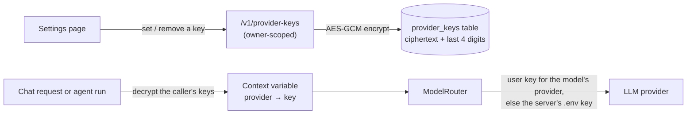

# Bring-Your-Own Provider Keys

Design note for *Identity & Keys — bring-your-own provider keys* (a Phase 1
leftover). Plain language; the task list lives in [BACKLOG.md](../BACKLOG.md).

## The problem

Every model call today uses the provider keys in the server's `.env`. That is
fine for one developer, but the platform is multi-user by design: each person
should be able to bring their own Anthropic / OpenAI / Gemini key, spend their
own quota, and remove the key at any time — without their secret ever sitting
readable in the database.

## The design

- **Storage** — one row per (user, provider) in `provider_keys`. The key is
  encrypted with AES-GCM (`engine/security/crypto.py`); only the ciphertext
  and the last four characters (for the settings page to display) are stored.
  The encryption key comes from `ENGINE_ENCRYPTION_KEY`; when unset (dev), it
  is derived from `ENGINE_SERVICE_SECRET`, so production must set a dedicated
  value.
- **API** — `GET /v1/provider-keys` lists what is configured (provider, last
  four, when) — never the key itself, not even encrypted. `PUT
  /v1/provider-keys/{provider}` sets or replaces; `DELETE` removes. Providers
  are an allow-list: `anthropic`, `openai`, `gemini`.
- **Resolution order** — the router prefers *the caller's key for the model's
  provider*, and falls back to the server's `.env` key when the user has none.
  The user's keys ride a **context variable** set once at the entry points (a
  chat request; a run's planning and execution), so nothing between the
  endpoint and the router needs new parameters — and the router stays the
  single gateway to litellm (ADR-0006).
- **Settings page** — `/settings` shows the three providers, which have a key
  (masked to the last four), and lets the user set or remove one.

## Organization-shared keys *(added 2026-07-18)*

A team should not need every member to paste the same key. A key can now be
**shared with the active organization** — an explicit choice, never a
default, because a key is a secret:

- **Sharing is opt-in per key.** The settings page gains a "share with the
  active organization" checkbox; `PUT /v1/provider-keys/{provider}` takes
  `share_with_organization` (400 without an active organization). A shared
  key carries `org_id`; a personal key stays `org_id NULL`. One org key per
  (organization, provider); one personal key per (user, provider) — partial
  unique indexes replace the old constraint.
- **Resolution order: personal → organization → `.env`.** Your own key
  always outranks the team's; the team's outranks the server's. The org
  rides along everywhere the caller's identity already does: the JWT's
  `org` claim at the API entry points, and the run's own `org_id` in the
  runner.
- **Members are equal collaborators** (ORGANIZATION_SHARING.md): any member
  sees the org key on the settings page (provider + last four + a shared
  tag — never the key), and any member may replace or remove it.
  `provider_keys` joins the org-shared RLS tables so Postgres itself
  enforces the visibility.
- **Switching away hides it.** The org key applies only while that
  organization is active — the same rule as every shared resource.

## Boundaries
- Repository indexing (embeddings) keeps using the server's key: it runs in a
  background task with no obvious "caller", and embedding cost is small.
  Revisit if hosted multi-tenancy arrives.
- The webhook PR reviewer keeps the server's key for the same reason — GitHub,
  not a user, triggers it.
- No key validation call on save — a wrong key fails at first use with the
  provider's own error, which the run timeline already surfaces.
