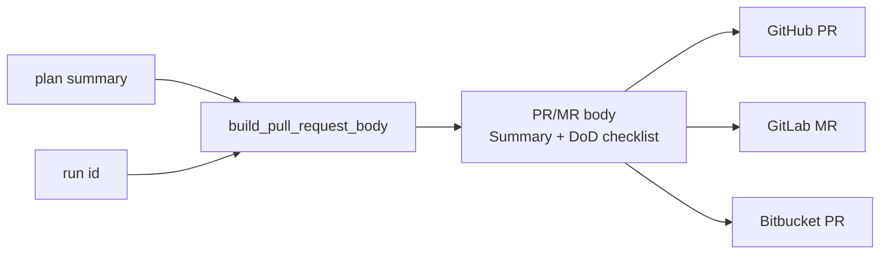

# Pull request body — the full Definition of Done

**Status:** shipped · **Design note**

When the agent team publishes a run, it opens a pull request (GitHub), a merge
request (GitLab), or a pull request (Bitbucket). Until now the body was the plan
summary plus a one-line note: `Review checklist: correctness, scope, security,
consistency.` That was a placeholder — the backlog item promised the **full
Definition-of-Done checklist** from `.github/PULL_REQUEST_TEMPLATE.md`.

## What it does

`build_pull_request_body(plan_summary, run_id)` (in
`engine/agents/pull_request.py`) returns the markdown body:

- a **Summary** section — the plan the Product Manager wrote;
- an attribution line naming the run;
- a **Definition of Done** section — the ten checklist items, unchecked.

One pure function feeds all three hosts, so every published request carries the
same checklist. It is a plain string builder — no model call, no database, no
network — so it is trivially testable and runs offline, the same shape as
`build_run_report`.

## Two deliberate choices

- **The boxes are left unchecked.** The agent team cannot honestly self-certify a
  human review (UI/UX reviewed, security reviewed, …). The checklist is the
  reviewer's to work through; the body says so in a line above it.
- **The items are embedded in code, not read from the template file.** The
  deployed engine ships without the repository's `.github/` directory, so reading
  `PULL_REQUEST_TEMPLATE.md` from disk would fail in production. The list is
  copied into `DEFINITION_OF_DONE` and a test pins the two in sync — if the
  template changes, the test fails until the code catches up.

## Kept in sync

`tests/test_pull_request_body.py` reads the checklist lines out of
`.github/PULL_REQUEST_TEMPLATE.md` and asserts they match `DEFINITION_OF_DONE`,
so the human-facing template and the agent-generated body never drift apart.
