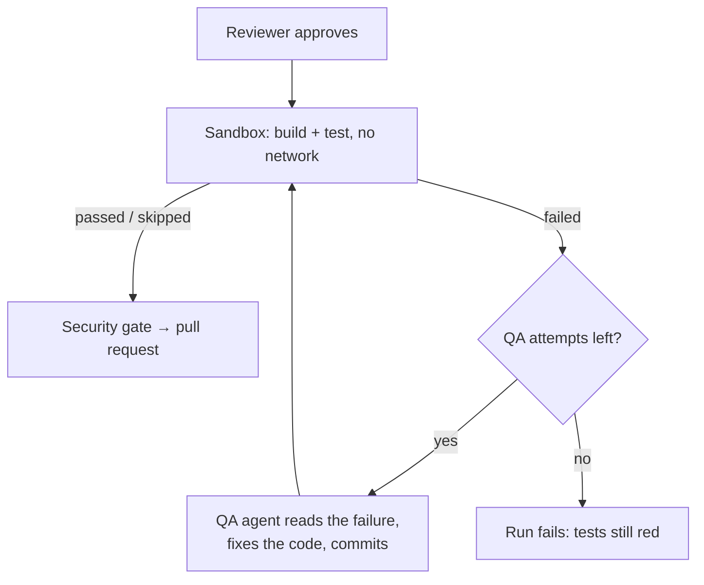

# QA Agent & Self-Correction Loop

Phase 3 design note. Plain language; the task list lives in
[BACKLOG.md](../BACKLOG.md). Builds directly on
[SANDBOX_EXECUTION.md](SANDBOX_EXECUTION.md).

## The problem

The sandbox runs the run's tests before a pull request opens. Until now a
failing test simply **failed the run** — the engineers' work was thrown away
even when the fix was a one-liner. A human would instead read the failure, patch
the code, and run the tests again. The QA agent does exactly that, a bounded
number of times, before giving up.

## How it works

When the sandbox reports `failed`, the runner hands the captured test output to
the **QA agent** (a distinct role, like the Reviewer). The QA agent has the
engineer tool set — it reads the failing files, edits them, and commits a fix —
then the runner re-runs the sandbox. It repeats up to `QA_MAX_ATTEMPTS` times
(default 2). The first attempt that turns the sandbox green lets the run proceed
to the security gate; if the attempts run out, the run fails with the last
reason.

A `skipped` sandbox (Docker down, no recognized tests) never triggers QA — there
is no failure signal to act on, so the run proceeds exactly as before.

## Guardrails

- **The QA agent may not game the tests.** Its prompt forbids deleting or
  skipping tests, weakening assertions, or `xfail`-ing failures to force a pass.
  It fixes the code under test, not the test that caught it.
- **Bounded.** At most `QA_MAX_ATTEMPTS` fix-and-retry cycles, so a run can never
  loop forever burning tokens and container time.
- **Every cycle is on the timeline.** Each fix emits a `qa.attempt` event (role,
  attempt number, summary) and each re-run emits a `sandbox.run` event carrying
  its attempt number, so the audit trail shows exactly what QA changed and what
  the tests did afterwards.

## Offline behavior

With `LLM_FAKE=1` the sandbox is skipped, so the loop is never entered in normal
offline runs. The QA agent's offline path (a deterministic commit) exists only
so the loop itself can be tested end to end with a faked sandbox.

## Settings

| Setting | Default | Meaning |
|---|---|---|
| `QA_MAX_ATTEMPTS` | `2` | Fix-and-retry cycles before the run fails on red tests |
