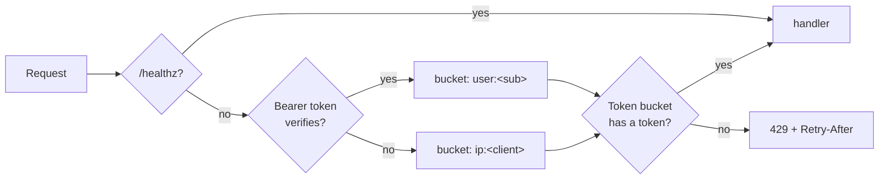
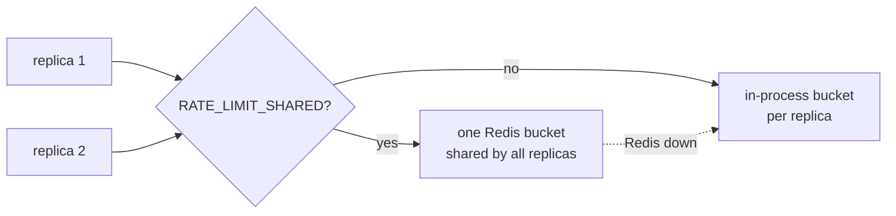

# Rate Limiting

Phase 7, Hardening-the-Seams workstream — the debt-register item parked for
this phase. Plain language; the task list lives in [BACKLOG.md](../BACKLOG.md).

## The problem

Nothing stops one caller from hammering the engine. That was fine while the
platform had one developer; a hosted deployment needs a ceiling — both against
abuse and against one user's runaway script starving everyone else. The debt
register has carried "no rate limiting on the BFF or engine" since Phase 0.

## The design

- **Token bucket per caller.** Each key holds `RATE_LIMIT_BURST` tokens and
  refills at `RATE_LIMIT_PER_MINUTE / 60` per second — bursts are fine, a
  sustained flood is not. A request with no token gets **429** with a
  `Retry-After` header saying when the next token lands.
- **Keyed by who, not where, when possible.** The middleware verifies the
  bearer JWT with the same secret the auth dependency uses: a valid token
  buckets by `user:` (one user cannot starve another), anything else —
  no token, invalid, fabricated — buckets by `ip:<client>`, so an
  unauthenticated flood is contained without letting made-up subs mint fresh
  buckets.
- **Off by default.** `RATE_LIMIT_PER_MINUTE=0` (the default) disables the
  middleware entirely — dev and tests are unaffected until a test opts in.
- **Placed inside the tracing middleware**, so 429s land in the request
  metrics and traces like any other response — the observability slice makes
  the limiter observable for free.
- `/healthz` is exempt: liveness probes must never be throttled.
- Stale buckets are pruned so the table cannot grow without bound.

## One window across every replica (`RATE_LIMIT_SHARED`)

The in-process buckets each replica keeps mean the *effective* ceiling is
`limit × replicas` — three replicas at 60/min let a caller do 180/min. For a
single-replica deployment that is exactly the limit; once the chart scales the
engine out, the ceiling should be the number you configured, not a multiple of
it. Setting `RATE_LIMIT_SHARED=1` moves the bucket into Redis so every replica
draws from the same tokens.

- **The bucket lives in a Redis hash, taken by a Lua script.** The same
  token-bucket arithmetic as the in-process path (`tokens`, `last_refill`,
  refill-then-take) runs *inside Redis* as one atomic script, so two replicas
  taking the last token at the same instant cannot both win. The current wall
  clock is passed in as an argument — no dependence on Redis's own clock — and
  the key carries a TTL a little longer than a full refill, so idle callers
  expire on their own (the shared path needs no pruning sweep).
- **Redis down degrades to per-replica, never to a hard dependency.** If Redis
  is unreachable the limiter falls back to the same in-process bucket the
  default path uses and logs one warning. A Redis outage therefore drops the
  ceiling back to `limit × replicas` — exactly today's behaviour — and never
  turns the limiter into a 429 storm or a source of request failures. The API
  never blocks on Redis to answer a request.
- **Off by default, like the limiter itself.** `RATE_LIMIT_SHARED=0` (the
  default) keeps everything in-process, so dev and the test suite touch Redis
  only in the tests that opt in. Production sets it to `1`.

## Boundaries

- **Per replica by default.** Without `RATE_LIMIT_SHARED`, the buckets are
  in-process and the effective limit is `limit × replicas` — fine for a single
  replica, and the shared window above closes the gap when it is not.
- One global rate for all routes; per-route tiers (cheaper reads, dearer
  LLM-backed writes) are a refinement once real traffic shows the shape.
- The BFF itself stays unlimited: every BFF call lands on the engine, so the
  engine's ceiling covers that path; direct BFF abuse is bounded by
  better-auth session churn.
