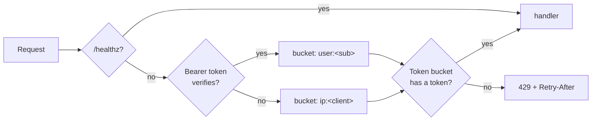

# Rate Limiting

Phase 7, Hardening-the-Seams workstream — the debt-register item parked for
this phase. Plain language; the task list lives in [BACKLOG.md](../BACKLOG.md).

## The problem

Nothing stops one caller from hammering the engine. That was fine while the
platform had one developer; a hosted deployment needs a ceiling — both against
abuse and against one user's runaway script starving everyone else. The debt
register has carried "no rate limiting on the BFF or engine" since Phase 0.

## The design

- **Token bucket per caller.** Each key holds `RATE_LIMIT_BURST` tokens and
  refills at `RATE_LIMIT_PER_MINUTE / 60` per second — bursts are fine, a
  sustained flood is not. A request with no token gets **429** with a
  `Retry-After` header saying when the next token lands.
- **Keyed by who, not where, when possible.** The middleware verifies the
  bearer JWT with the same secret the auth dependency uses: a valid token
  buckets by `user:` (one user cannot starve another), anything else —
  no token, invalid, fabricated — buckets by `ip:<client>`, so an
  unauthenticated flood is contained without letting made-up subs mint fresh
  buckets.
- **Off by default.** `RATE_LIMIT_PER_MINUTE=0` (the default) disables the
  middleware entirely — dev and tests are unaffected until a test opts in.
- **Placed inside the tracing middleware**, so 429s land in the request
  metrics and traces like any other response — the observability slice makes
  the limiter observable for free.
- `/healthz` is exempt: liveness probes must never be throttled.
- Stale buckets are pruned so the table cannot grow without bound.

## Boundaries

- **Per replica.** The buckets are in-process; each engine replica enforces
  its own ceiling, so the effective limit is `limit × replicas`. Good enough
  until the Deploy workstream — a Redis-backed shared window (degrading open
  when Redis is down) is the follow-up if replica counts grow.
- One global rate for all routes; per-route tiers (cheaper reads, dearer
  LLM-backed writes) are a refinement once real traffic shows the shape.
- The BFF itself stays unlimited: every BFF call lands on the engine, so the
  engine's ceiling covers that path; direct BFF abuse is bounded by
  better-auth session churn.
