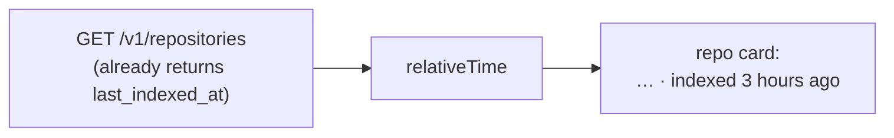

# Showing When a Repository Was Last Indexed

**Status:** Design accepted · **Phase:** 8 follow-up · **Written:** 2026-07-24

## The problem

A connected repository's search index is a snapshot — it reflects the code as of
the last time it was indexed. The API has always returned `last_indexed_at`, and
the web type carries it, but the repositories page never showed it. So a repo
that was indexed weeks ago looks identical to one indexed minutes ago; you can't
tell whether a search is answering from current code or stale code, and you don't
know when a re-index is worth running.

## The design

The repo card shows a plain relative time next to its chunk count — `1,240
indexed pieces · indexed 3 hours ago`. It reads the `last_indexed_at` the API
already returns; nothing new is fetched or stored.

- **One small reusable helper.** `relativeTime(iso, now?)` in `web/src/lib`
  turns an ISO timestamp into `just now`, `5 minutes ago`, `3 hours ago`,
  `2 days ago`, … — coarse, human, and pure. It takes an optional `now` so it is
  unit-testable without mocking the clock, and returns `""` for a null timestamp
  (a never-indexed repo shows only its "not indexed yet" line).
- **Purely presentational.** No API, type, or schema change — the value is
  already on the wire. The card just renders it beside the existing count.
- **Reusable by design.** The helper lives in `lib`, not the repositories
  folder, so the runs list and elsewhere can adopt the same "… ago" phrasing
  later without a second implementation.

## Boundaries

- **Coarse, not exact.** It reports the largest *whole* unit that fits (minutes,
  hours, days, …) — enough to judge freshness at a glance, and it never rolls an
  age up to the next unit early. A precise timestamp lives in the `title`/hover if
  ever needed; the card stays uncluttered.
- **Freshness, not staleness policy.** It reports *when*, and does not judge
  whether the index is "too old" or auto-trigger a re-index. Scheduled or
  drift-triggered re-indexing remains a separate, larger feature.
