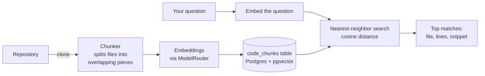

# Repository Intelligence

Phase 2 design note. Plain language; the task list lives in
[BACKLOG.md](../BACKLOG.md).

## The problem

The agents and the chat only see whatever files they happen to open. Ask
"where is authentication handled?" and nothing can answer without reading the
whole repository. The fix: an **index** — every file split into small pieces,
each piece stored with a mathematical fingerprint (an *embedding*) that
captures what the code means, so similar-meaning questions find it.

## How it works

- **Chunker** (`engine/indexing/chunker.py`) — version 1 splits every text
  file into overlapping line windows and records the language from the file
  extension. AST-aware chunking with tree-sitter (split at functions and
  classes) replaces this later; the table schema doesn't change.
- **Embeddings** — one new `ModelRouter.embed()` route (`MODEL_EMBEDDING` in
  `.env`, Gemini's embedding model by default, 768 numbers per chunk).
  `LLM_FAKE=1` produces deterministic fake vectors so tests run offline.
- **Storage** — one table, `code_chunks`: repository id, path, line range,
  language, the text, and the embedding (`vector(768)`). Re-indexing a
  repository replaces its chunks.
- **Search** — embed the question, order chunks by cosine distance, return
  the closest ones with file and line numbers. This is now the vector arm of
  **hybrid search**, which adds a Postgres full-text arm and fuses the two with
  reciprocal-rank fusion — design note:
  [HYBRID_RETRIEVAL.md](HYBRID_RETRIEVAL.md).

## API

- `POST /v1/repositories` — connect (or find) a repository by URL
- `GET /v1/repositories` — your repositories with their index status
- `POST /v1/repositories/{id}/index` — clone and index it (background)
- `GET /v1/repositories/{id}/search?q=...` — ask the index a question

## What this is not (yet)

No dependency graphs, no citations inside chat, no incremental re-indexing,
no Java/Kotlin grammar — those are separate backlog items in this phase.
